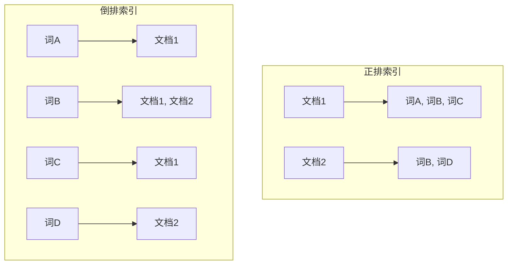
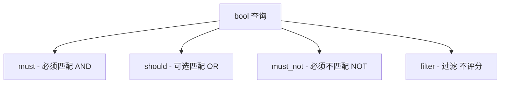
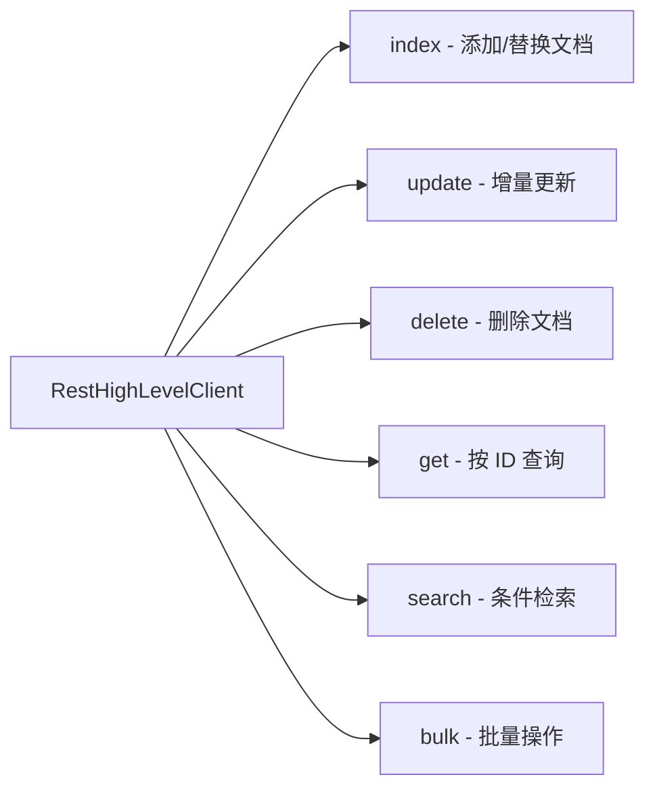

# 搜索引擎概述

**概述：** Elasticsearch（简称 ES）是一个基于 ==Lucene== 构建的分布式、开源的全文搜索与分析引擎。当数据量达到百万甚至千万级别时，传统数据库的 `LIKE` 模糊查询性能急剧下降，搜索引擎通过预构建索引的方式将检索速度提升到毫秒级。常见的搜索引擎有 **Solr** 和 **Elasticsearch**，ES 凭借近实时搜索、原生分布式、RESTful API 等优势成为当前主流选择。

**概述：** ES 的核心工作流程可概括为：写入时自动分词并构建索引，查询时对关键词分词后从索引中快速匹配结果。百度、京东、淘宝等平台的搜索功能底层均依赖类似机制。


# 倒排索引原理

**概述：** ==倒排索引==（Inverted Index）是搜索引擎的核心数据结构，与传统数据库的正排索引方向相反。正排索引是「文档 → 词」的映射（通过文档 ID 找内容），倒排索引是「词 → 文档」的映射（通过关键词找到包含它的文档列表）。

**概述：** 倒排索引的构建过程：对每条文档的文本内容进行分词，提取出所有词项（Term），然后建立「词项 → 文档 ID 列表」的映射关系。查询时只需查找词项对应的文档 ID 集合，无需逐行扫描，时间复杂度接近 **O(1)**。

假设有如下数据：

| 文档 ID | 内容 |
|---------|------|
| 11 | 五粮液白酒 52度 |
| 12 | 五粮液白酒 39度 |
| 13 | 洋河白酒 蓝色经典 |
| 14 | 洋河白酒 梦之蓝 |

构建的倒排索引如下：

| 词项 | 文档 ID 列表 |
|------|-------------|
| 洋河 | 13, 14 |
| 白酒 | 11, 12, 13, 14 |
| 五粮液 | 11, 12 |

**概述：** 查询「洋河」时，直接在倒排索引中定位到文档 13、14，无需全表扫描。这就是 ES 能在海量数据中实现毫秒级检索的根本原因。MySQL 使用 **B+ Tree** 组织索引数据，适合精确匹配和范围查询；而倒排索引专为全文检索设计，两者互补而非替代。



# ES 核心概念

**概述：** ES 的数据模型与关系型数据库存在对应关系，理解这一映射是掌握 ES 的基础。ES 7.x 版本开始逐步弱化 Type 概念，一个 Index 下只允许一个 Type（默认为 `_doc`）。

| ES 概念 | MySQL 类比 | 说明 |
|---------|-----------|------|
| **Index**（索引） | Database（数据库） | 存放相似结构文档的集合 |
| **Type**（类型） | Table（表） | 7.x 后一个 Index 仅一个 Type，默认 `_doc` |
| **Document**（文档） | Row（行） | 一条 JSON 格式的数据记录 |
| **Field**（字段） | Column（列） | 文档中的键值对 |
| **Mapping**（映射） | Schema（表结构） | 定义字段的数据类型与分词策略 |

**概述：** ES 的数据以 ==JSON 文档== 形式存储。每个文档有一个唯一的 `_id`，可以手动指定或由 ES 自动生成。文档被写入时，ES 会根据 Mapping 的定义对字段进行分词和索引。

# RESTful API 交互

**概述：** ES 暴露了基于 HTTP 的 RESTful API，所有操作均通过 HTTP 方法 + URL + JSON 请求体完成。默认端口为 `9200`，可使用任意 HTTP 客户端（`curl`、Postman、Kibana Dev Tools）与 ES 通信。

| HTTP 方法 | 操作语义 | URL 示例 |
|-----------|---------|---------|
| `POST` | 新增文档（可自动生成 ID） | `POST /index/_doc` |
| `POST` | 新增文档（指定 ID） | `POST /index/_doc/1` |
| `PUT` | 创建或全量替换文档 | `PUT /index/_doc/1` |
| `GET` | 查询文档 | `GET /index/_doc/1` |
| `DELETE` | 删除文档 | `DELETE /index/_doc/1` |

**概述：** `_cat` API 提供人类可读的集群信息。常用命令：

```bash
# 查看集群健康状态
GET /_cat/health?v

# 查看所有索引
GET /_cat/indices?v

# 查看节点信息
GET /_cat/nodes?v
```

集群健康状态用颜色表示：**green**（有主有副本，高可用）、**yellow**（有主无副本，数据完整但不高可用）、**red**（数据不完整）。

# 文档 CRUD 操作

## 新增文档

**概述：** 使用 `POST` 或 `PUT` 方法添加文档。`POST` 不指定 ID 时会自动生成，`PUT` 必须指定 ID。如果指定的 ID 已存在，`POST` 和 `PUT` 都会执行==全量替换==（版本号递增）。

```json
// POST 新增（自动 ID）
POST /users/_doc
{
  "name": "张三",
  "age": 25,
  "skill": "Java"
}

// PUT 新增（指定 ID）
PUT /users/_doc/1
{
  "name": "李四",
  "age": 28,
  "skill": "Python"
}
```

## 更新文档

**概述：** 全量替换直接使用 `PUT`，会用新文档覆盖旧文档的全部字段。增量更新使用 `POST ... /_update`，只修改指定字段，未指定的字段保持不变。

```json
// 增量更新（推荐）
POST /users/_doc/1/_update
{
  "doc": {
    "age": 29
  }
}
```

## 删除文档

```json
DELETE /users/_doc/1
```

## 查询文档

```json
// 按 ID 查询
GET /users/_doc/1

// 查询索引下所有文档
GET /users/_search

// 简单条件查询（URL 参数方式）
GET /users/_search?q=name:张三
```

# 分词与中文分词

**概述：** 分词（Analysis）是 ES 的核心能力之一。写入文档时，ES 对 `text` 类型字段的值进行分词，将结果写入倒排索引；查询时，对搜索关键词同样进行分词后再匹配。ES 内置的 **Standard Analyzer** 按空格和标点分词，适用于英文，但会将中文拆分为==单个字==，无法满足中文搜索需求。

**概述：** **IK 分词器** 是最常用的中文分词插件，提供两种分词策略：

| 策略 | 说明 | 示例（输入：「中华人民共和国」） |
|------|------|------|
| `ik_smart` | ==最粗粒度拆分==，优先匹配最长词 | 中华人民共和国 |
| `ik_max_word` | ==最细粒度拆分==，穷举所有可能的词组合 | 中华人民共和国、中华人民、中华、华人、人民共和国、人民、共和国、共和、国 |

**概述：** `ik_smart` 适合搜索场景（减少噪音），`ik_max_word` 适合索引场景（提高召回率）。常见的最佳实践是：==写入时用 `ik_max_word`，搜索时用 `ik_smart`==。

**概述：** IK 分词器支持通过自定义词典扩展词库。编辑 `IKAnalyzer.cfg.xml` 配置文件，指向自定义词典文件（`.dic`），词典中每行一个词。修改后需重启 ES 生效。

```xml
<properties>
    <entry key="ext_dict">custom_dict.dic</entry>
    <entry key="ext_stopwords">stopwords.dic</entry>
</properties>
```

# 查询 DSL

## match 查询

**概述：** `match` 是最常用的全文检索查询，会对查询关键词进行分词，然后在倒排索引中匹配。多个关键词之间默认是 **OR** 关系（任一匹配即返回），匹配度越高的文档评分（`_score`）越高，排序越靠前。

```json
GET /index/_search
{
  "query": {
    "match": {
      "title": "洋河 白酒"
    }
  }
}
```

## bool 组合查询

**概述：** `bool` 查询通过 `must`（AND）、`should`（OR）、`must_not`（NOT）、`filter`（过滤）组合多个条件，实现复杂的逻辑查询。`filter` 不参与评分计算，性能优于 `must`，适合精确匹配和范围过滤。

```json
GET /index/_search
{
  "query": {
    "bool": {
      "must": [
        { "match": { "title": "吉他" } }
      ],
      "should": [
        { "match": { "title": "尤克里里" } }
      ],
      "must_not": [
        { "match": { "title": "电子" } }
      ],
      "filter": [
        { "range": { "price": { "gte": 500, "lte": 5000 } } }
      ]
    }
  }
}
```



## range 范围查询

**概述：** 用于数字、日期等有序类型的范围过滤。操作符：`gt`（>）、`gte`（>=）、`lt`（<）、`lte`（<=）。

```json
// 数字范围
{ "range": { "price": { "gte": 100, "lte": 999 } } }

// 日期范围
{ "range": { "created": { "gt": "2024-01-01", "lt": "2024-12-31" } } }
```

## term 精确查询

**概述：** `term` 查询不对查询关键词分词，将其作为一个整体去匹配。适用于 `keyword`、数字、布尔、日期等精确值字段。==注意==：对 `text` 类型字段使用 `term` 查询通常查不到结果，因为 `text` 字段的值在写入时已被分词，而 `term` 查询不分词，两者无法匹配。

```json
GET /index/_search
{
  "query": {
    "term": {
      "tag": "热门"
    }
  }
}
```

## 高亮查询

**概述：** 高亮查询在匹配结果的关键词两侧添加 HTML 标签（如 `<em>`），用于前端展示时突出显示搜索关键词。ES 不修改原始 `_source` 数据，高亮结果放在独立的 `highlight` 字段中。

```json
GET /index/_search
{
  "query": {
    "match": { "title": "吉他" }
  },
  "highlight": {
    "pre_tags": ["<em>"],
    "post_tags": ["</em>"],
    "fields": {
      "title": {}
    }
  }
}
```

## 指定返回字段

**概述：** 使用 `_source` 参数指定返回的字段，减少网络传输量，等价于 SQL 中的 `SELECT col1, col2`。

```json
GET /index/_search
{
  "query": { "match_all": {} },
  "_source": ["title", "price"]
}
```

## 排序与分页

**概述：** 通过 `sort` 指定排序字段和方向（`asc`/`desc`），通过 `from` + `size` 实现分页。==注意==：设置 `sort` 后 `_score` 不再计算（值为 `null`），因为排序依据已从相关性变为指定字段。ES 的深度分页（`from` 值很大）性能较差，生产环境推荐使用 `search_after` 或 Scroll API。

```json
GET /index/_search
{
  "sort": [
    { "price": "desc" },
    { "created": "asc" }
  ],
  "from": 0,
  "size": 10
}
```

# 自定义映射

**概述：** Mapping 定义了索引中字段的数据类型和分词策略，类似于数据库建表时的 Schema。如果不手动定义 Mapping，ES 会根据写入的第一条文档==自动推断==字段类型（Dynamic Mapping），但推断结果不一定符合需求（如中文字段不会自动使用 IK 分词器）。

```json
PUT /emp
{
  "mappings": {
    "properties": {
      "name": {
        "type": "text",
        "analyzer": "ik_max_word"
      },
      "skill": {
        "type": "text",
        "analyzer": "ik_max_word"
      },
      "age": {
        "type": "integer"
      },
      "tag": {
        "type": "keyword"
      }
    }
  }
}
```

**概述：** 常用字段类型说明：

| 类型 | 说明 |
|------|------|
| `text` | 全文检索字段，会被分词，不可用于排序和聚合 |
| `keyword` | 精确值字段，==不分词==，整体作为一个词项，可排序和聚合 |
| `integer` / `long` | 整数类型 |
| `float` / `double` | 浮点数类型 |
| `date` | 日期类型，支持多种格式 |
| `boolean` | 布尔类型 |

# Java High Level REST Client

## 核心对象

**概述：** `RestHighLevelClient` 是 ES 官方提供的 Java 高级 REST 客户端，封装了所有 ES 操作的 Java API。每种操作对应一组 **Request / Response** 对象，通过 `client.xxx(request, RequestOptions.DEFAULT)` 统一调用。



## 添加文档

**概述：** 通过 `IndexRequest` 添加文档，支持三种数据格式：JSON 字符串、Map、Key-Value 键值对。如果指定的 ID 已存在，则执行全量替换。

```java
IndexRequest request = new IndexRequest("product");
request.id("1");

// 方式一：Map
Map<String, Object> data = new HashMap<>();
data.put("title", "尤克里里 23英寸");
data.put("price", 500);
request.source(data);

// 方式二：JSON 字符串
String json = new ObjectMapper().writeValueAsString(data);
request.source(json, XContentType.JSON);

// 方式三：Key-Value
request.source("title", "尤克里里", "price", 500);

IndexResponse response = client.index(request, RequestOptions.DEFAULT);
```

## 批量操作

**概述：** `BulkRequest` 将多个操作（增、删、改）合并为一次网络请求，显著减少网络开销。批量操作是 ES 数据导入和同步的标准方式。

```java
BulkRequest bulkRequest = new BulkRequest();
for (Map<String, Object> item : dataList) {
    IndexRequest req = new IndexRequest("product");
    req.source(item);
    bulkRequest.add(req);
}
BulkResponse response = client.bulk(bulkRequest, RequestOptions.DEFAULT);
```

## 更新与删除

```java
// 增量更新
UpdateRequest updateReq = new UpdateRequest("product", "1");
updateReq.doc(Map.of("price", 599));
client.update(updateReq, RequestOptions.DEFAULT);

// 删除
DeleteRequest deleteReq = new DeleteRequest("product", "1");
client.delete(deleteReq, RequestOptions.DEFAULT);
```

## 按 ID 查询

```java
GetRequest request = new GetRequest("product", "1");
GetResponse response = client.get(request, RequestOptions.DEFAULT);
if (response.isExists()) {
    Map<String, Object> source = response.getSourceAsMap();
}
```

## Search 条件检索

**概述：** `SearchRequest` + `SearchSourceBuilder` 组合实现条件检索。`SearchSourceBuilder` 负责构建查询体（条件、排序、分页、高亮等），所有条件通过 `QueryBuilders` 工具类创建。

```java
SearchRequest request = new SearchRequest("product");
SearchSourceBuilder builder = new SearchSourceBuilder();

// 构建 bool 查询
BoolQueryBuilder boolQuery = QueryBuilders.boolQuery();
boolQuery.must(QueryBuilders.matchQuery("title", "吉他"));
boolQuery.filter(QueryBuilders.rangeQuery("price").gte(500).lte(5000));

builder.query(boolQuery);
builder.sort("price", SortOrder.DESC);
builder.from(0);
builder.size(10);

request.source(builder);
SearchResponse response = client.search(request, RequestOptions.DEFAULT);

// 遍历结果
SearchHits hits = response.getHits();
for (SearchHit hit : hits) {
    Map<String, Object> source = hit.getSourceAsMap();
}
```

## 高亮查询

**概述：** 高亮结果不在 `_source` 中，需要从 `SearchHit.getHighlightFields()` 单独获取，然后手动替换原始字段值。

```java
SearchSourceBuilder builder = new SearchSourceBuilder();
builder.query(QueryBuilders.matchQuery("title", "吉他"));

HighlightBuilder highlightBuilder = new HighlightBuilder();
highlightBuilder.field("title");
highlightBuilder.preTags("<em>");
highlightBuilder.postTags("</em>");
builder.highlighter(highlightBuilder);

// 处理高亮结果
for (SearchHit hit : hits) {
    Map<String, Object> source = hit.getSourceAsMap();
    HighlightField titleHL = hit.getHighlightFields().get("title");
    if (titleHL != null) {
        source.put("title", titleHL.getFragments()[0].string());
    }
}
```

## QueryBuilders 常用方法

| 方法 | 说明 |
|------|------|
| `matchAllQuery()` | 匹配全部 |
| `matchQuery(field, value)` | 全文检索（分词匹配） |
| `termQuery(field, value)` | 精确匹配（不分词） |
| `boolQuery()` | 布尔组合查询 |
| `rangeQuery(field)` | 范围查询 |
| `fuzzyQuery(field, value)` | 模糊查询（容错匹配） |
| `wildcardQuery(field, pattern)` | 通配符查询 |

## 模糊查询

**概述：** 模糊查询允许查询关键词存在拼写错误时仍然能匹配到结果。`fuzziness` 参数控制允许的最大编辑距离（Levenshtein Distance），默认值为 `AUTO`，最大容错范围为 0\~2 个字符。

```java
builder.query(QueryBuilders.fuzzyQuery("title", "ukulele")
    .fuzziness(Fuzziness.ONE));
```

## Further Reading

- [Elasticsearch 官方文档（7.x）](https://www.elastic.co/guide/en/elasticsearch/reference/7.x/index.html)
- [Elasticsearch Java REST Client](https://www.elastic.co/guide/en/elasticsearch/client/java-rest/7.x/index.html)
- [IK Analysis 插件 GitHub](https://github.com/medcl/elasticsearch-analysis-ik)
- [Elasticsearch 权威指南（中文版）](https://www.elastic.co/guide/cn/elasticsearch/guide/current/index.html)
