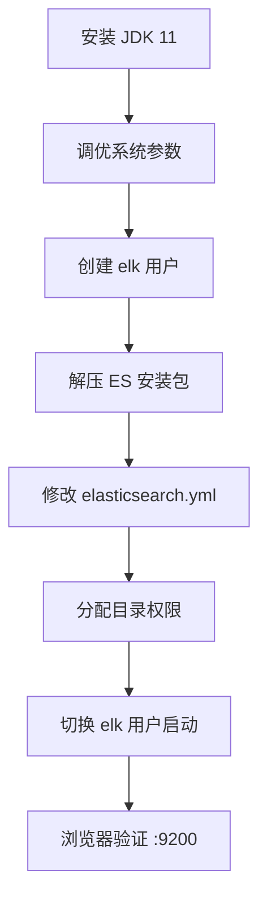

# 环境要求

**概述：** Elasticsearch 7.x 运行需要 ==JDK 11+== 环境，且对系统资源有较高要求。推荐使用 CentOS 7 作为部署系统，虚拟机内存至少分配 **2GB**。ES 5.0 起禁止使用 `root` 用户启动，需创建专用用户。

| 依赖项 | 最低要求 |
|-------|---------|
| 操作系统 | CentOS 7 / Ubuntu 18.04+ |
| JDK | 11 及以上 |
| 内存 | ≥ 2GB |
| 启动用户 | 非 root 用户 |

# JDK 配置

**概述：** 将 JDK 11 安装包上传到 Linux 并解压，配置 `JAVA_HOME` 环境变量。ES 7.x 自带 bundled JDK，但建议使用系统级 JDK 以便统一管理。

```bash
# 解压 JDK
tar -zxvf jdk-11.x.x_linux-x64_bin.tar.gz -C /opt/

# 配置环境变量
vi /etc/profile
# 添加以下内容
export JAVA_HOME=/opt/jdk-11
export PATH=$JAVA_HOME/bin:$PATH

# 使配置生效
source /etc/profile
java -version
```

# 系统参数调优

**概述：** ES 对虚拟内存、文件描述符等系统资源有特殊要求。不调优这些参数会导致 ES 启动失败或运行不稳定。

## 内核参数

```bash
vi /etc/sysctl.conf
```

添加以下配置（`max_map_count` 控制进程可拥有的最大内存映射区域数）：

```
vm.max_map_count=655360
```

```bash
# 使配置立即生效
sysctl -p
```

## 文件描述符与进程数限制

```bash
vi /etc/security/limits.conf
```

添加以下配置：

```
* soft nofile 65536
* hard nofile 131072
* soft nproc 65536
* hard nproc 131072
```

## 用户级资源参数

```bash
vi /etc/security/limits.d/20-nproc.conf
```

为 ES 专用用户设置进程数：

```
elk    soft    nproc     65536
```

# 用户与权限配置

**概述：** ES 强制要求使用==非 root 用户==启动。以下步骤创建 `elk` 用户并分配必要的目录权限。

```bash
# 创建用户和组
useradd elk
groupadd elk
useradd elk -g elk

# 设置密码
passwd elk

# 创建数据和日志目录
mkdir -pv /opt/elk/{data,logs}

# 分配目录权限
chown -R elk:elk /opt/elk/
chown -R elk:elk /opt/elasticsearch-7.6.2/
```

# Elasticsearch 配置

**概述：** ES 的核心配置文件为 `config/elasticsearch.yml`，主要配置集群名、节点名、数据路径、网络绑定地址等。

```bash
vi /opt/elasticsearch-7.6.2/config/elasticsearch.yml
```

关键配置项：

```yaml
# 集群名称（同一集群的节点必须一致）
cluster.name: my-es-cluster

# 节点名称
node.name: node-1

# 数据存储路径
path.data: /opt/elk/data

# 日志存储路径
path.logs: /opt/elk/logs

# 绑定地址（0.0.0.0 允许外部访问）
network.host: 0.0.0.0

# HTTP 端口
http.port: 9200

# 集群初始主节点（单机模式）
cluster.initial_master_nodes: ["node-1"]

# 跨域配置（允许 Kibana 等工具访问）
http.cors.enabled: true
http.cors.allow-origin: "*"
```

# 启动与验证

**概述：** 切换到 `elk` 用户启动 ES 服务。后台运行需追加 `&` 符号，关闭服务需通过 `kill` 命令终止进程。

```bash
# 切换用户
su elk

# 前台启动（调试用）
/opt/elasticsearch-7.6.2/bin/elasticsearch

# 后台启动（生产用）
/opt/elasticsearch-7.6.2/bin/elasticsearch &

# 关闭防火墙或开放 9200 端口
sudo systemctl stop firewalld
# 或
sudo firewall-cmd --add-port=9200/tcp --permanent
sudo firewall-cmd --reload
```

**概述：** 浏览器访问 `http://<服务器IP>:9200`，返回 JSON 信息（包含集群名、版本号等）即表示启动成功。

```json
{
  "name": "node-1",
  "cluster_name": "my-es-cluster",
  "version": {
    "number": "7.6.2"
  },
  "tagline": "You Know, for Search"
}
```



## Further Reading

- [Elasticsearch 安装指南（官方）](https://www.elastic.co/guide/en/elasticsearch/reference/7.x/install-elasticsearch.html)
- [ES 重要系统配置](https://www.elastic.co/guide/en/elasticsearch/reference/7.x/system-config.html)
- [ES 国内镜像加速下载](https://www.newbe.pro/Mirrors/Mirrors-Elasticsearch/)
