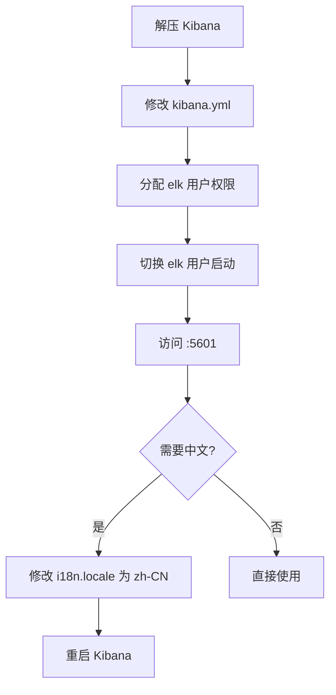

# 安装 Kibana

**概述：** Kibana 是 ES 的官方可视化管理工具，提供 Dev Tools 控制台用于执行 DSL 查询、监控集群状态、管理索引等。==Kibana 版本必须与 Elasticsearch 版本严格一致==。

```bash
# 上传安装包到 /opt 目录并解压
tar -zxvf kibana-7.6.2-linux-x86_64.tar.gz -C /opt/
```

# 配置 Kibana

**概述：** 修改 Kibana 配置文件 `config/kibana.yml`，设置服务监听地址和 ES 连接地址。

```bash
vi /opt/kibana-7.6.2-linux-x86_64/config/kibana.yml
```

关键配置项：

```yaml
# Kibana 监听端口
server.port: 5601

# 监听地址（0.0.0.0 允许外部访问）
server.host: "0.0.0.0"

# ES 服务地址
elasticsearch.hosts: ["http://localhost:9200"]
```

# 权限与启动

**概述：** Kibana 同样需要使用==非 root 用户==启动。为 `elk` 用户分配 Kibana 目录权限后再启动。

```bash
# root 下分配权限
chown -R elk:elk /opt/kibana-7.6.2-linux-x86_64

# 切换到 elk 用户
su elk

# 前台启动
/opt/kibana-7.6.2-linux-x86_64/bin/kibana

# 后台启动
nohup /opt/kibana-7.6.2-linux-x86_64/bin/kibana &
```

**概述：** 浏览器访问 `http://<服务器IP>:5601` 进入 Kibana 界面。首次访问会提示加载示例数据（Try our sample data），点击左侧菜单 **Dev Tools** 进入控制台执行 DSL 查询。

# 中文界面设置

**概述：** Kibana 7.x 内置中文语言包，修改配置文件即可切换。需要先停止 Kibana 服务再修改。

```bash
vi /opt/kibana-7.6.2-linux-x86_64/config/kibana.yml
```

修改最后一行 `i18n.locale` 配置：

```yaml
i18n.locale: "zh-CN"
```

**概述：** 修改完成后重启 Kibana 即可看到中文界面。



## Further Reading

- [Kibana 安装指南（官方）](https://www.elastic.co/guide/en/kibana/7.x/install.html)
- [Kibana 配置参考](https://www.elastic.co/guide/en/kibana/7.x/settings.html)
