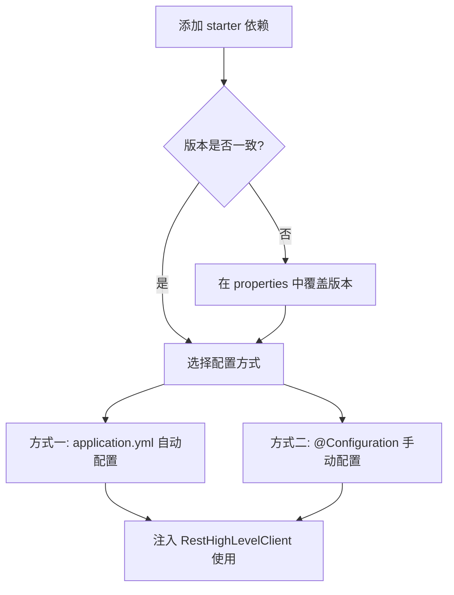

# 依赖配置

**概述：** Spring Boot 通过 `spring-boot-starter-data-elasticsearch` 场景启动器集成 ES，自动引入 `elasticsearch-rest-high-level-client` 等依赖。==需注意 Spring Boot 仲裁的 ES 版本可能与实际使用的 ES 版本不一致==，必须手动对齐。

```xml
<dependency>
    <groupId>org.springframework.boot</groupId>
    <artifactId>spring-boot-starter-data-elasticsearch</artifactId>
</dependency>
```

# 版本对齐

**概述：** 在 `pom.xml` 的 `<properties>` 中覆盖 Spring Boot 仲裁的 ES 版本，确保客户端版本与 ES 服务端版本一致。

```xml
<properties>
    <elasticsearch.version>7.6.2</elasticsearch.version>
</properties>
```

**概述：** 版本不一致可能导致 API 不兼容或功能缺失。可通过 IDE 的依赖树查看当前仲裁版本：`spring-boot-dependencies` → `elasticsearch.version`。

# 手动配置客户端

**概述：** 通过 `@Configuration` 类手动注册 `RestHighLevelClient` Bean，适用于需要自定义连接参数的场景。

```java
@Configuration
public class ESClientConfig {

    @Bean
    @ConditionalOnMissingBean
    public RestHighLevelClient restHighLevelClient() {
        return new RestHighLevelClient(
            RestClient.builder(
                new HttpHost("192.168.37.153", 9200, "http")
            )
        );
    }
}
```

**概述：** `@ConditionalOnMissingBean` 确保容器中没有其他 `RestHighLevelClient` 实例时才创建，避免与自动配置冲突。集群环境下可传入多个 `HttpHost`：

```java
RestClient.builder(
    new HttpHost("node1", 9200, "http"),
    new HttpHost("node2", 9200, "http"),
    new HttpHost("node3", 9200, "http")
)
```

# 自动配置（推荐）

**概述：** Spring Boot 提供了 `ElasticsearchRestClientAutoConfiguration` 自动配置类，只需在 `application.yml` 中声明连接信息即可，无需手动编写配置类。

```yaml
spring:
  elasticsearch:
    rest:
      # ES 服务器地址，集群配置多个
      uris:
        - http://192.168.37.153:9200
      # 读取超时
      read-timeout: 30s
      # 连接超时
      connection-timeout: 5s
```



# 常用配置项

| 配置项 | 说明 | 默认值 |
|-------|------|-------|
| `spring.elasticsearch.rest.uris` | ES 节点地址列表 | `http://localhost:9200` |
| `spring.elasticsearch.rest.username` | 认证用户名 | — |
| `spring.elasticsearch.rest.password` | 认证密码 | — |
| `spring.elasticsearch.rest.connection-timeout` | 连接超时 | `1s` |
| `spring.elasticsearch.rest.read-timeout` | 读取超时 | `30s` |

## Further Reading

- [Spring Boot Elasticsearch 自动配置文档](https://docs.spring.io/spring-boot/docs/current/reference/html/data.html#data.nosql.elasticsearch)
- [Elasticsearch Java REST Client 官方文档](https://www.elastic.co/guide/en/elasticsearch/client/java-rest/7.x/java-rest-high.html)
