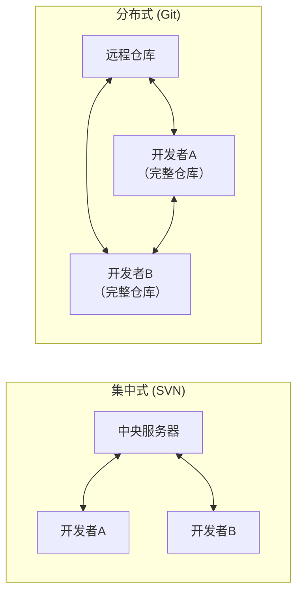
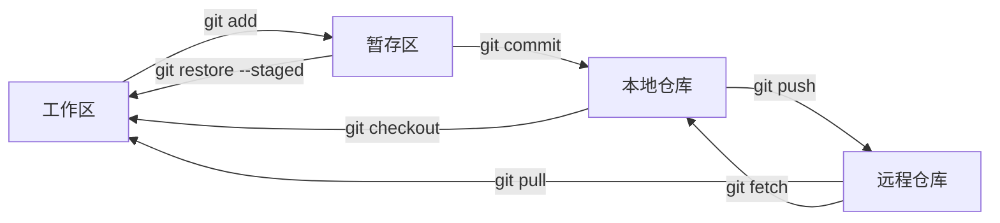
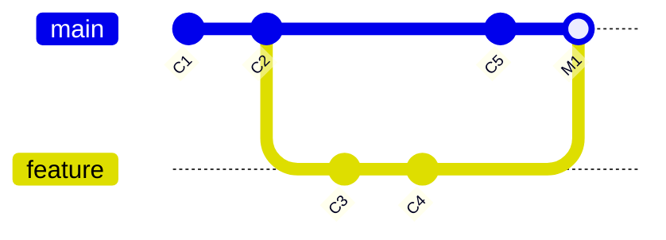
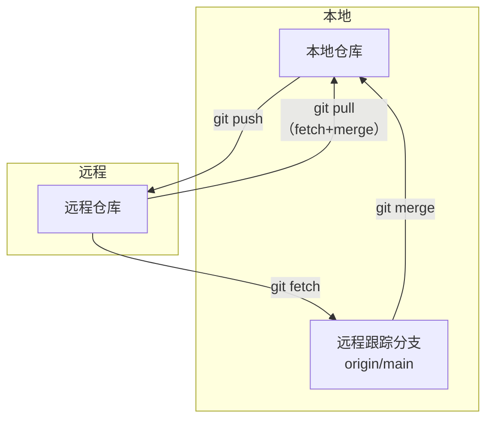
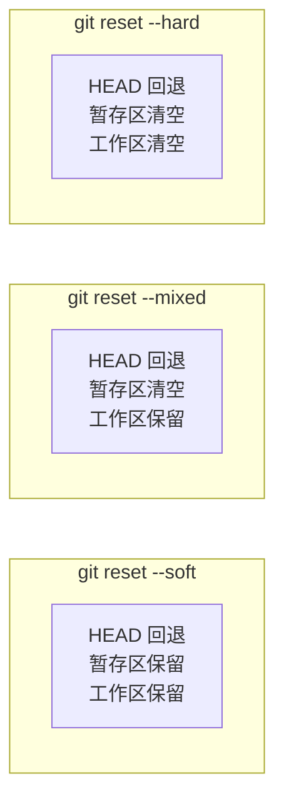
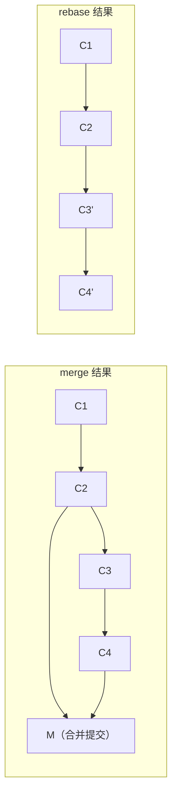

# 版本控制概念

**概述：** 版本控制（Version Control）是一种记录文件内容变化、以便将来查阅或恢复特定版本的系统。没有版本控制时，开发者只能手动复制文件夹（`项目_v1`、`项目_v2`、`项目_最终版`、`项目_最最终版`），既低效又极易丢失变更历史。

**概述：** 版本控制系统分为三代演进：

| 类型 | 代表工具 | 特点 | 缺陷 |
|------|---------|------|------|
| 本地版本控制 | RCS | 本地数据库记录文件差异 | 无法多人协作 |
| 集中式版本控制 | SVN、CVS | ==单一中央服务器==存储所有版本 | 服务器故障即全部丢失 |
| 分布式版本控制 | ==Git==、Mercurial | 每个客户端都是完整仓库镜像 | 学习曲线较陡 |

**概述：** Git 由 Linus Torvalds 于 2005 年开发，专为 Linux 内核开发设计。核心设计目标：==速度快==（几乎所有操作本地完成）、==完全分布式==（无需网络即可提交、查看历史、创建分支）、==数据完整性==（SHA-1 哈希校验每次提交）。



# Git 工作区模型

**概述：** Git 管理文件的核心在于==三个区域==和==一个远程==，理解它们之间的数据流动是掌握 Git 的关键：

| 区域 | 英文名 | 作用 |
|------|--------|------|
| **工作区** | Working Directory | 实际编辑文件的目录，即项目文件夹 |
| **暂存区** | Staging Area / Index | 下次提交的快照预览，通过 `git add` 放入 |
| **本地仓库** | Local Repository | `.git` 目录，存储所有提交历史 |
| **远程仓库** | Remote Repository | GitHub/GitLab 等托管平台上的仓库 |



**概述：** 文件在 Git 中有四种状态：==Untracked==（未跟踪，新建文件）、==Modified==（已修改，工作区有变更但未暂存）、==Staged==（已暂存，通过 `git add` 放入暂存区）、==Committed==（已提交，安全存储在本地仓库）。

# 仓库初始化

**概述：** 获取 Git 仓库有两种方式：在本地目录初始化新仓库，或从远程克隆已有仓库。

```bash
# 方式一：初始化新仓库（在当前目录创建 .git 子目录）
git init

# 方式二：克隆远程仓库（自动创建目录、初始化 .git、拉取所有数据）
git clone https://github.com/user/repo.git

# 克隆时指定本地目录名
git clone https://github.com/user/repo.git my-project
```

**概述：** `git init` 执行后会创建一个隐藏的 `.git` 目录，其中包含 Git 所需的所有元数据（对象数据库、引用、HEAD 指针等）。==绝不要手动修改 `.git` 目录的内容==。

# 基础操作

## 查看状态

**概述：** `git status` 是最常用的命令，显示工作区和暂存区的当前状态：哪些文件被修改、哪些已暂存、哪些未跟踪。

```bash
# 完整状态
git status

# 简洁格式（M=已修改 A=已暂存 ??=未跟踪）
git status -s
```

## 添加与提交

**概述：** `git add` 将工作区的变更添加到暂存区，`git commit` 将暂存区的内容创建为一个永久快照（提交对象）。==每次提交都是项目在该时刻的完整快照==，而非差异补丁。

```bash
# 暂存指定文件
git add file.txt

# 暂存所有已修改和新增文件
git add .

# 提交（打开编辑器写提交信息）
git commit

# 提交（行内写提交信息）
git commit -m "feat: 添加用户登录功能"

# 跳过暂存区，直接提交所有已跟踪文件的修改
git commit -a -m "fix: 修复空指针异常"
```

**概述：** 提交信息（Commit Message）应简洁描述==为什么==做这个变更，而非罗列改了哪些文件。常见规范如 Conventional Commits：`feat:`（新功能）、`fix:`（修复）、`docs:`（文档）、`refactor:`（重构）。

## 查看差异

**概述：** `git diff` 精确展示文件级别的变更内容，是代码审查和提交前检查的核心工具。

```bash
# 工作区 vs 暂存区（未暂存的修改）
git diff

# 暂存区 vs 最新提交（即将提交的修改）
git diff --staged

# 两个提交之间的差异
git diff commit1 commit2

# 仅显示有变更的文件名
git diff --name-only
```

## 查看历史

**概述：** `git log` 显示提交历史，从最近到最远排列。常用参数组合可极大提升效率。

```bash
# 默认格式（完整信息）
git log

# 单行简洁格式
git log --oneline

# 图形化显示分支合并历史
git log --oneline --graph --all

# 显示每次提交的文件变更统计
git log --stat

# 显示每次提交的具体差异
git log -p

# 限制显示最近 N 条
git log -5

# 按作者/时间/关键词筛选
git log --author="张三"
git log --since="2024-01-01" --until="2024-06-30"
git log --grep="修复"
```

# 分支管理

**概述：** 分支是 Git 最强大的特性之一。Git 的分支本质上只是一个==指向某个提交对象的可移动指针==，创建和切换分支几乎瞬间完成（不像 SVN 需要复制整个目录）。`HEAD` 是一个特殊指针，指向当前所在的分支。



## 分支操作

```bash
# 查看所有本地分支（* 标记当前分支）
git branch

# 查看所有分支（含远程）
git branch -a

# 创建新分支（不切换）
git branch feature-login

# 创建并切换到新分支
git checkout -b feature-login
# 或 Git 2.23+ 推荐写法
git switch -c feature-login

# 切换分支
git checkout main
git switch main

# 删除已合并的分支
git branch -d feature-login

# 强制删除未合并的分支
git branch -D feature-login

# 重命名分支
git branch -m old-name new-name
```

**概述：** ==分支使用原则==：`main`/`master` 分支始终保持稳定可发布状态，所有新功能和修复都在独立分支上开发，完成后通过合并回主分支。

## 合并分支

**概述：** `git merge` 将指定分支的变更合并到当前分支。Git 根据两个分支的历史关系选择合并策略：

| 场景 | 策略 | 结果 |
|------|------|------|
| 当前分支无新提交 | ==Fast-forward==（快进） | 指针直接前移，不产生合并提交 |
| 双方都有新提交 | 三方合并（Three-way merge） | 创建一个新的合并提交 |
| 双方修改同一区域 | ==冲突== | 需手动解决后再提交 |

```bash
# 先切换到目标分支（如 main）
git switch main

# 合并 feature 分支到当前分支
git merge feature-login

# 合并时禁用快进（强制产生合并提交，保留分支历史）
git merge --no-ff feature-login
```

## 解决冲突

**概述：** 当两个分支修改了同一文件的同一区域时，Git 无法自动决定保留哪个版本，会在文件中插入冲突标记：

```
<<<<<<< HEAD
当前分支的内容
=======
合并进来的分支的内容
>>>>>>> feature-login
```

**概述：** 解决步骤：打开冲突文件 → 删除 `<<<<<<<`、`=======`、`>>>>>>>` 标记 → 保留正确的内容 → `git add` 标记已解决 → `git commit` 完成合并。

```bash
# 查看冲突文件
git status

# 手动编辑冲突文件后
git add resolved-file.txt
git commit -m "merge: 解决 feature-login 合并冲突"

# 放弃本次合并，回到合并前状态
git merge --abort
```

# 远程仓库操作

**概述：** 远程仓库是项目在网络上的托管副本（如 GitHub、GitLab），用于团队协作和代码备份。`origin` 是克隆时 Git 自动为远程仓库设置的默认别名。

## 远程管理

```bash
# 查看已配置的远程仓库
git remote -v

# 添加远程仓库
git remote add origin https://github.com/user/repo.git

# 修改远程仓库 URL
git remote set-url origin https://github.com/user/new-repo.git

# 删除远程关联
git remote remove origin
```

## 推送与拉取

```bash
# 推送本地分支到远程
git push origin main

# 首次推送并设置上游跟踪（后续可直接 git push）
git push -u origin main

# 推送所有本地分支
git push --all

# 拉取远程变更并合并到当前分支（= fetch + merge）
git pull origin main

# 仅获取远程变更，不自动合并（更安全）
git fetch origin

# 获取后手动查看和合并
git fetch origin
git log origin/main --oneline
git merge origin/main
```



**概述：** ==`git pull` vs `git fetch`==：`fetch` 只下载远程数据到本地的远程跟踪分支（如 `origin/main`），不修改工作区；`pull` 是 `fetch` + `merge` 的快捷方式，直接将远程变更合并到当前分支。在多人协作中，推荐先 `fetch` 再 `merge`，以便在合并前检查变更内容。

# 撤销与回退

**概述：** Git 提供多种撤销机制，理解它们的作用范围是避免数据丢失的关键。

## 工作区撤销

```bash
# 丢弃工作区中某个文件的修改（恢复到暂存区版本）
git checkout -- file.txt
# Git 2.23+ 推荐写法
git restore file.txt

# 丢弃所有工作区修改
git restore .
```

## 暂存区撤销

```bash
# 取消暂存（文件保留在工作区）
git reset HEAD file.txt
# Git 2.23+ 推荐写法
git restore --staged file.txt
```

## 提交撤销

**概述：** `git reset` 和 `git revert` 都能撤销提交，但机制和适用场景截然不同：

| 命令 | 机制 | 历史影响 | 适用场景 |
|------|------|---------|---------|
| `git reset` | ==移动 HEAD 指针==到指定提交 | 改写历史（删除后续提交） | 本地未推送的提交 |
| `git revert` | 创建一个==反向提交== | 不改写历史（追加新提交） | 已推送到远程的提交 |

```bash
# reset 三种模式
git reset --soft HEAD~1   # 仅撤销提交，变更保留在暂存区
git reset --mixed HEAD~1  # 撤销提交+暂存，变更保留在工作区（默认）
git reset --hard HEAD~1   # 撤销提交+暂存+工作区修改（危险！不可恢复）

# revert（安全撤销，创建反向提交）
git revert HEAD            # 撤销最新提交
git revert abc1234         # 撤销指定提交
```



**概述：** ==黄金法则==：已推送到远程的提交永远使用 `revert`，不要用 `reset`，因为 `reset` 改写历史会导致其他协作者的本地仓库与远程不一致。

# 标签管理

**概述：** 标签（Tag）用于给特定提交打上永久标记，通常用于标记==发布版本==（如 `v1.0.0`、`v2.1.3`）。标签与分支的区别是：标签是固定指针（不会随提交移动），分支是移动指针。

```bash
# 创建轻量标签（仅指针）
git tag v1.0.0

# 创建附注标签（推荐，包含作者/日期/说明）
git tag -a v1.0.0 -m "正式发布 1.0.0 版本"

# 给历史提交打标签
git tag -a v0.9.0 abc1234

# 查看所有标签
git tag

# 查看标签详情
git show v1.0.0

# 推送标签到远程
git push origin v1.0.0
git push origin --tags  # 推送所有标签

# 删除本地标签
git tag -d v1.0.0

# 删除远程标签
git push origin --delete v1.0.0
```

# 高级技巧

## 暂存工作区

**概述：** `git stash` 将当前工作区和暂存区的修改临时保存到栈中，使工作区恢复干净状态。适用于==紧急切换分支但当前工作未完成==的场景。

```bash
# 暂存当前修改
git stash

# 暂存时附加说明
git stash save "正在开发登录功能"

# 查看暂存列表
git stash list

# 恢复最近一次暂存（保留 stash 记录）
git stash apply

# 恢复并删除最近一次暂存
git stash pop

# 恢复指定的暂存
git stash apply stash@{2}

# 删除所有暂存
git stash clear
```

## 变基

**概述：** `git rebase` 将当前分支的提交"搬移"到目标分支的最新提交之后，形成==线性历史==（无合并提交）。与 `merge` 相比，`rebase` 产生的历史更整洁，但==会改写提交哈希==。

```bash
# 将 feature 分支变基到 main 最新提交之后
git switch feature
git rebase main

# 交互式变基（合并/修改/删除/重排最近 N 个提交）
git rebase -i HEAD~3
```



**概述：** ==rebase 黄金法则==：永远不要对已推送到远程的公共分支执行 `rebase`，因为它改写了提交历史，会导致其他人的本地仓库无法正常同步。

## 拣选提交

**概述：** `git cherry-pick` 将其他分支上的==指定提交==复制到当前分支，适用于只需要某几个提交而非整个分支的场景。

```bash
# 拣选单个提交
git cherry-pick abc1234

# 拣选多个提交
git cherry-pick abc1234 def5678

# 拣选但不自动提交（先放入暂存区）
git cherry-pick --no-commit abc1234
```

# Git 工作流

**概述：** 团队协作需要约定分支管理策略。以下是两种主流工作流：

## Git Flow

**概述：** Git Flow 定义了严格的分支模型，适合有明确发布周期的项目。

| 分支 | 生命周期 | 用途 |
|------|---------|------|
| `main` | 永久 | 生产环境代码，每个提交对应一个版本 |
| `develop` | 永久 | 集成开发分支，日常开发的主线 |
| `feature/*` | 临时 | 新功能开发，从 develop 分出，完成后合回 develop |
| `release/*` | 临时 | 发布准备，从 develop 分出，测试通过后合入 main 和 develop |
| `hotfix/*` | 临时 | 紧急修复，从 main 分出，修复后合入 main 和 develop |

```mermaid
gitGraph
    commit id: "init"
    branch develop
    commit id: "dev-1"
    branch feature/login
    commit id: "feat-1"
    commit id: "feat-2"
    checkout develop
    merge feature/login id: "merge-feat"
    branch release/1.0
    commit id: "rc-1"
    checkout main
    merge release/1.0 id: "v1.0" tag: "v1.0.0"
    checkout develop
    merge release/1.0 id: "sync"
```



## GitHub Flow

**概述：** GitHub Flow 是更简洁的工作流，只有一个长期分支 `main`，所有开发通过==功能分支 + Pull Request== 完成。适合持续部署的 Web 项目。

- 从 `main` 创建功能分支
- 在功能分支上开发并提交
- 创建 Pull Request 发起代码审查
- 审查通过后合并到 `main` 并自动部署

## Further Reading

- [Pro Git（官方免费电子书）](https://git-scm.com/book/zh/v2)
- [Git 官方参考手册](https://git-scm.com/docs)
- [Git Flow 工作流详解](https://nvie.com/posts/a-successful-git-branching-model/)
- [GitHub Flow 指南](https://docs.github.com/en/get-started/using-github/github-flow)
- [Conventional Commits 规范](https://www.conventionalcommits.org/zh-hans/)
- [Learn Git Branching（交互式学习）](https://learngitbranching.js.org/?locale=zh_CN)
