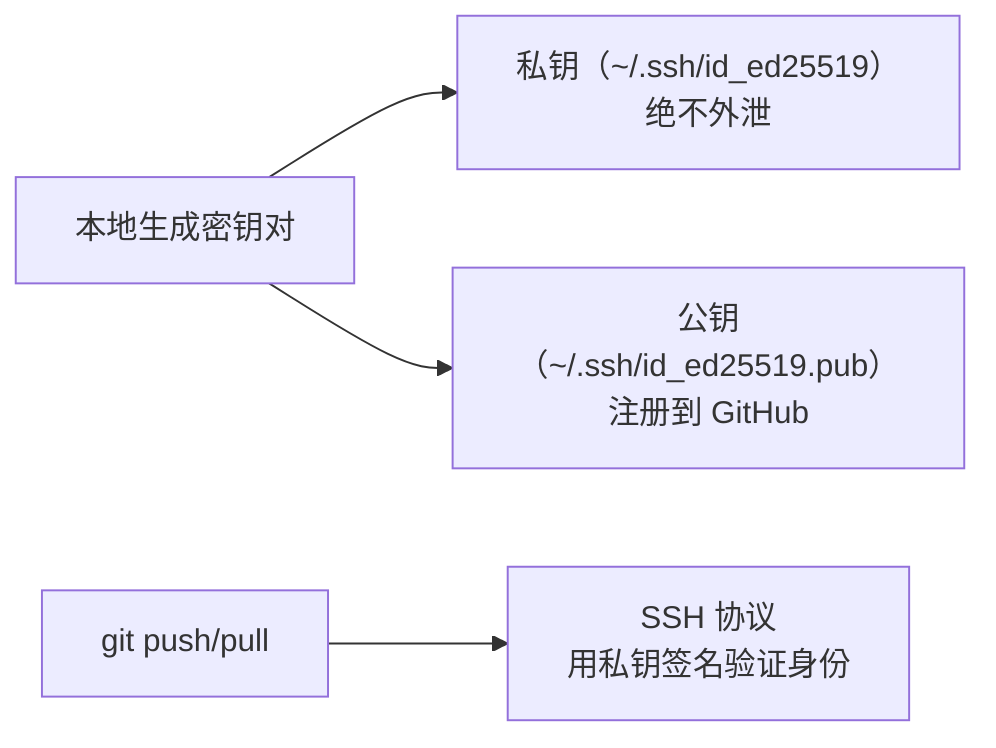

# 下载与安装

## Windows

**概述：** 从官网下载安装包，运行后按向导安装即可。安装过程中的关键选项建议保持默认，安装完成后可在任意目录右键菜单看到 ==Git Bash Here==。

```
下载地址：https://git-scm.com/download/win
```

**概述：** 安装向导中的重要选项：

| 选项 | 推荐值 | 说明 |
|------|-------|------|
| Default Editor | ==VS Code== | Git 默认编辑器（用于提交信息、rebase 等） |
| PATH environment | Git from the command line and also from 3rd-party software | 允许在 CMD/PowerShell 中使用 git 命令 |
| Line ending | Checkout Windows-style, commit Unix-style | ==换行符自动转换==，跨平台协作必选 |
| Default branch name | main | 新仓库默认分支名 |

## macOS

```bash
# 方式一：Homebrew 安装（推荐）
brew install git

# 方式二：Xcode Command Line Tools（系统自带）
xcode-select --install
```

## Linux

```bash
# Debian/Ubuntu
sudo apt update && sudo apt install git

# CentOS/RHEL
sudo yum install git

# Fedora
sudo dnf install git
```

## 验证安装

```bash
git --version
# 输出示例：git version 2.44.0
```

# 初始配置

**概述：** Git 的配置分为三个级别，优先级从高到低：

| 级别 | 文件位置 | 作用域 | 命令参数 |
|------|---------|-------|---------|
| 项目级 | `.git/config` | 当前仓库 | `--local` |
| 用户级 | `~/.gitconfig` | 当前用户所有仓库 | `--global` |
| 系统级 | `/etc/gitconfig` | 所有用户 | `--system` |

## 用户信息

**概述：** ==必须配置==，每次提交都会记录这两项信息。配置后可通过 `git log` 看到作者信息。

```bash
git config --global user.name "你的名字"
git config --global user.email "your-email@example.com"
```

## 默认编辑器

```bash
# 设置 VS Code 为默认编辑器
git config --global core.editor "code --wait"

# 设置 Vim
git config --global core.editor vim
```

## 默认分支名

**概述：** Git 2.28+ 支持自定义新仓库的默认分支名（替代旧的 `master`）。

```bash
git config --global init.defaultBranch main
```

## 换行符处理

**概述：** Windows 使用 `CRLF`（`\r\n`），Linux/macOS 使用 `LF`（`\n`）。==跨平台项目必须统一换行符==，否则会产生大量无意义的差异。

```bash
# Windows 用户：签出时转为 CRLF，提交时转为 LF
git config --global core.autocrlf true

# Linux/macOS 用户：仅在提交时修正误入的 CRLF
git config --global core.autocrlf input
```

## 查看配置

```bash
# 查看所有配置及其来源
git config --list --show-origin

# 查看某项配置
git config user.name
```

# SSH 密钥配置

**概述：** SSH 密钥用于免密码与远程仓库通信。相比 HTTPS + 密码/Token，SSH 更安全且无需每次输入凭证。原理是==非对称加密==：本地保留私钥，将公钥注册到 GitHub/GitLab。



## 生成密钥

```bash
# 生成 Ed25519 密钥（推荐，比 RSA 更安全更快）
ssh-keygen -t ed25519 -C "your-email@example.com"

# 如果系统不支持 Ed25519，使用 RSA
ssh-keygen -t rsa -b 4096 -C "your-email@example.com"
```

**概述：** 执行后按提示操作：选择保存路径（默认 `~/.ssh/id_ed25519` 即可）→ 设置密码短语（可留空，但设置后更安全）。生成后在 `~/.ssh/` 目录下会有两个文件：`id_ed25519`（私钥）和 `id_ed25519.pub`（公钥）。

## 注册公钥到 GitHub

```bash
# 复制公钥内容
cat ~/.ssh/id_ed25519.pub
# Windows 用户也可用：
clip < ~/.ssh/id_ed25519.pub
```

**概述：** 复制输出内容后，进入 GitHub → Settings → SSH and GPG keys → New SSH key → 粘贴公钥 → 保存。

## 测试连接

```bash
ssh -T git@github.com
# 成功输出：Hi username! You've been authenticated...
```

## 使用 SSH 地址

**概述：** 配置 SSH 后，克隆和远程地址应使用 ==SSH 格式==（`git@`）而非 HTTPS。

```bash
# SSH 格式克隆
git clone git@github.com:user/repo.git

# 将已有仓库的远程地址从 HTTPS 切换到 SSH
git remote set-url origin git@github.com:user/repo.git
```

# .gitignore 配置

**概述：** `.gitignore` 文件指定 Git 应忽略的文件和目录（不纳入版本控制）。通常忽略编译产物、依赖目录、IDE 配置、系统文件和敏感信息。==`.gitignore` 本身应被提交到仓库==。

## 语法规则

| 模式 | 说明 | 示例 |
|------|------|------|
| `file.txt` | 忽略指定文件 | `secret.key` |
| `*.log` | 通配符匹配 | 忽略所有 `.log` 文件 |
| `dir/` | 忽略整个目录 | `node_modules/` |
| `!file` | 取反（不忽略） | `!important.log` |
| `#` | 注释 | `# 这是注释` |
| `**/` | 匹配任意层级 | `**/temp/` |

## 常用模板

```gitignore
# Java
target/
*.class
*.jar

# Node.js
node_modules/
dist/
.env

# IDE
.idea/
.vscode/
*.iml

# 操作系统
.DS_Store
Thumbs.db

# 日志
*.log
logs/
```

## 已跟踪文件处理

**概述：** `.gitignore` 只对==未跟踪==的文件生效。如果某个文件已经被提交到仓库，后续添加到 `.gitignore` 不会自动忽略它，需要先从 Git 的跟踪中移除：

```bash
# 从 Git 跟踪中移除，但保留本地文件
git rm --cached file.txt

# 从 Git 跟踪中移除整个目录
git rm -r --cached node_modules/

# 移除后提交
git commit -m "chore: 移除误提交的文件"
```

# Git 凭证管理

**概述：** 使用 HTTPS 方式访问远程仓库时，每次 push/pull 都需要输入用户名和密码（或 Token）。通过凭证管理器可以缓存认证信息。

```bash
# macOS：使用系统钥匙串
git config --global credential.helper osxkeychain

# Windows：使用 Windows 凭证管理器（Git for Windows 自带）
git config --global credential.helper manager

# Linux：缓存到内存（默认 15 分钟）
git config --global credential.helper cache
git config --global credential.helper 'cache --timeout=3600'

# 永久存储到磁盘（明文，不推荐）
git config --global credential.helper store
```

**概述：** GitHub 从 2021 年起不再支持密码认证，需使用 ==Personal Access Token (PAT)== 替代密码。创建路径：GitHub → Settings → Developer settings → Personal access tokens → Generate new token。

## Further Reading

- [Git 官方安装指南](https://git-scm.com/book/zh/v2/%E8%B5%B7%E6%AD%A5-%E5%AE%89%E8%A3%85-Git)
- [GitHub SSH 密钥文档](https://docs.github.com/en/authentication/connecting-to-github-with-ssh)
- [.gitignore 模板集合](https://github.com/github/gitignore)
- [Git 凭证存储](https://git-scm.com/book/zh/v2/Git-%E5%B7%A5%E5%85%B7-%E5%87%AD%E8%AF%81%E5%AD%98%E5%82%A8)
- [GitHub PAT 文档](https://docs.github.com/en/authentication/keeping-your-account-and-data-secure/managing-your-personal-access-tokens)
