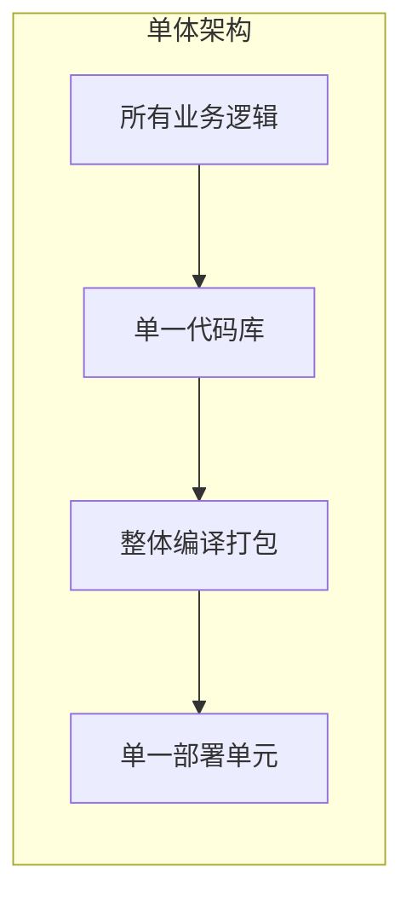
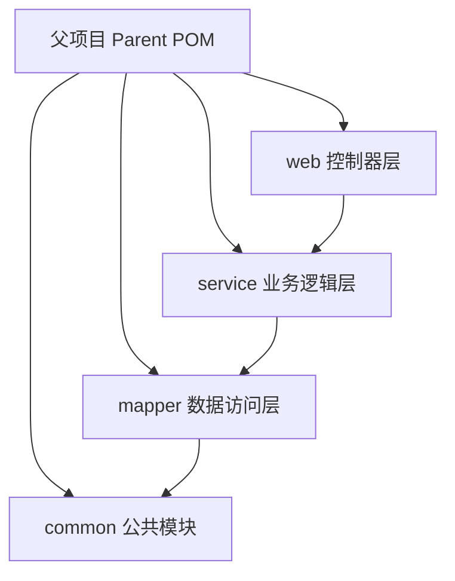
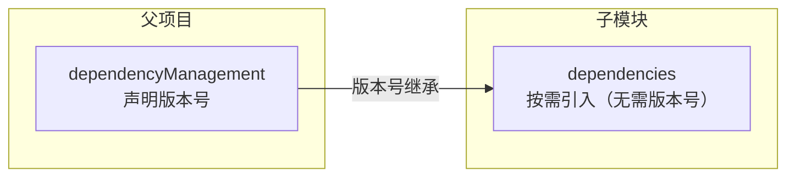
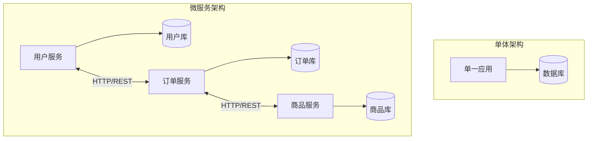
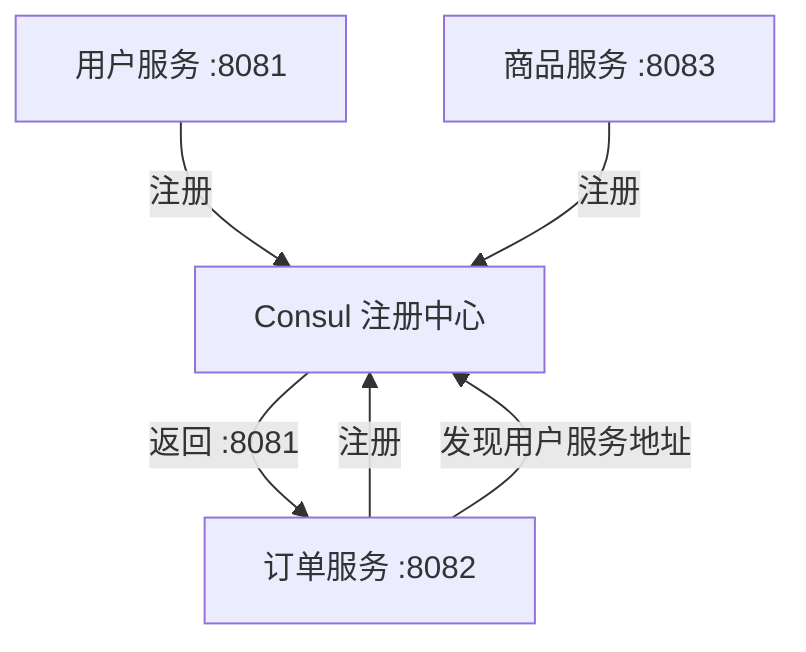
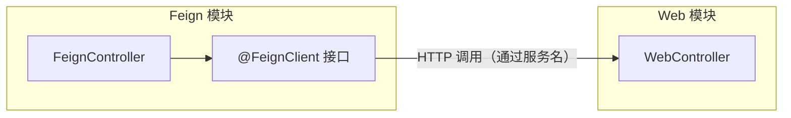

# 单体架构的局限性

**概述：** 单体架构（Monolithic Architecture）将全部业务逻辑编写在同一个工程中，编译打包后部署到一台服务器运行。项目早期开发速度快、运维简单，但随着业务增长，三个核心矛盾逐渐显现：==代码膨胀导致可维护性下降==、==全量部署导致变更风险高==、==水平扩展受限导致并发瓶颈==。

**概述：** 单体架构的主要问题可归纳为以下几类：

- **代码管理困难**：代码库庞大，可读性和可维护性持续恶化
- **构建部署慢**：每次改动需全量构建和部署，小变更也承担全量风险
- **团队协作冲突**：多人修改同一模块，合并冲突频繁，职责边界模糊
- **扩展性差**：无法针对热点模块单独扩容，缺乏灵活性
- **测试复杂**：模块紧耦合，难以进行独立单元测试，覆盖率低
- **技术债务累积**：依赖升级和重构牵一发而动全身，长期维护成本高

**概述：** 这些问题驱动了两种演进方向：==多模块项目==（代码层面拆分，单体部署）和==微服务架构==（服务层面拆分，独立部署）。前者是轻量级改进，后者是架构范式变革。

# 多模块项目

**概述：** 多模块项目（Multi-Module Project）将一个大型应用拆分为多个独立但关联的子模块，每个模块有自己的代码、资源和配置，所有模块共享同一个父项目（Maven/Gradle），由父项目集中管理依赖和构建。==这是在不引入分布式复杂度的前提下，解决单模块代码膨胀问题的最有效方式。==

**概述：** 多模块项目的核心优势：

- **模块化解耦**：按职责划分模块，遵循==单一职责原则==，代码结构清晰
- **代码复用**：公共代码（实体类、工具类、配置）集中在 common 模块，其他模块按需引用
- **独立开发测试**：每个模块可单独编译、测试、调试，互不干扰
- **并行协作**：不同团队负责不同模块，职责明确，减少代码冲突
- **统一依赖管理**：父项目集中管理依赖版本，避免版本冲突

## 父项目

**概述：** 父项目是多模块项目的管理中枢，==不包含实际业务代码==，其 `pom.xml` 的 `<packaging>` 类型为 `pom`。父项目的核心职责是：统一管理依赖版本、统一配置构建插件、声明所有子模块。

## 子模块划分

**概述：** 子模块按功能职责划分，典型的分层方式如下：

| 模块 | 职责 | 典型内容 |
|------|------|---------|
| **common** | 公共代码 | 实体类、工具类、通用配置、常量 |
| **mapper** | 数据访问层 | MyBatis/MyBatis-Plus 接口、XML 映射文件 |
| **service** | 业务逻辑层 | Service 接口与实现类 |
| **web** | 控制器层 | Controller、启动类、应用配置 |

**概述：** 模块间的依赖关系遵循==自上而下单向依赖==原则：web → service → mapper → common。由于 Maven 的依赖传递特性，web 模块引入 service 后，会自动获得 mapper 和 common 的依赖，无需重复声明。

## 依赖版本管理

**概述：** Maven 的 `<dependencyManagement>` 是多模块项目版本控制的核心机制。它==只声明版本号，不实际引入依赖==——子模块需要某个依赖时，只需写 `groupId` 和 `artifactId`，版本号自动从父项目继承。

**概述：** 关键区别：未使用 `dependencyManagement` 时，父项目 `<dependencies>` 中的所有依赖会被子模块==全部继承==；使用后，子模块==按需引入==，不会继承未声明的依赖。这避免了子模块引入不必要的依赖。

# 微服务架构

**概述：** 微服务架构（Microservice Architecture）将应用拆分为多个==独立部署、独立运行==的小型服务，每个服务专注于单一业务功能，通过轻量级通信机制（通常是 HTTP/REST）进行交互。与多模块项目的"代码拆分但统一部署"不同，微服务实现了==运行时的物理隔离==。

**概述：** "微"体现在两个维度：==体积小==（单个服务只做一件事，代码量少，复杂度低）和==团队小==（8-10 人即可覆盖从设计到运维的全流程）。

**概述：** 微服务架构解决了单体架构的核心矛盾：各服务独立部署降低了变更风险、可针对热点服务单独扩容、不同服务可选用不同技术栈。但也引入了==分布式系统的固有复杂度==：服务发现、负载均衡、容错处理、分布式事务、链路追踪等问题需要专门的基础设施支撑。

# Spring Cloud

**概述：** Spring Cloud 是基于 Spring Boot 的==微服务全家桶==，由 Pivotal 和 Netflix 联合维护。它不是单一框架，而是将市面上成熟的微服务组件（服务发现、负载均衡、熔断、网关等）整合起来，通过 Spring Boot 的自动配置机制统一封装，提供开箱即用的分布式系统开发工具包。

**概述：** ==Spring Cloud 不能脱离 Spring Boot 独立运行==，它通过 Spring Boot 的 starter 机制引入各组件。Spring Cloud 的版本采用伦敦地铁站名（如 Greenwich、Hoxton）或年份命名（如 2021.0.x），需与 Spring Boot 版本严格对应。

# Consul 服务发现

**概述：** ==服务发现==是微服务架构的基石。在单体架构中，模块间通过方法调用通信；在微服务架构中，服务实例的地址是动态的（可能随部署变化），需要一个中心化的注册中心来管理服务实例的注册与查找。

**概述：** Consul 是 HashiCorp 开发的分布式服务发现与配置管理工具，提供==服务注册与发现==、==健康检查==、==KV 存储==、==多数据中心==等功能。每个微服务启动时向 Consul 注册自身地址，其他服务通过 Consul 查询目标服务的可用实例。

**概述：** Consul 的工作流程：服务启动时通过 `spring-cloud-starter-consul-discovery` 自动向 Consul 注册，并定期发送==心跳==（heartbeat）证明自身存活。Consul 维护一张实时的服务清单，消费方通过服务名（而非 IP:Port）查找目标服务，Consul 返回可用实例列表。

# OpenFeign 服务调用

**概述：** 服务发现解决了"找到谁"的问题，服务调用解决了"怎么调"的问题。传统方式使用 `RestTemplate` 手动拼接 URL 发起 HTTP 请求，代码冗长且难以维护。

**概述：** OpenFeign（全称 Spring Cloud OpenFeign）是 Spring 官方推出的==声明式服务调用组件==，用于替代已停更的 Netflix Feign。它在 Feign 的基础上增加了对 Spring MVC 注解（`@RequestMapping`、`@GetMapping` 等）的支持，使远程调用的代码风格与本地 Controller 一致。

**概述：** OpenFeign 的核心思想是==接口即契约==：定义一个 Java 接口，用 `@FeignClient(value = "服务名")` 标注，接口方法的签名与目标服务的 Controller 方法保持一致。OpenFeign 在运行时通过动态代理生成实现类，自动完成服务发现、负载均衡和 HTTP 请求的发送。

**概述：** OpenFeign 与 Feign 的关系：

| 特性 | Netflix Feign | Spring Cloud OpenFeign |
|------|--------------|----------------------|
| 维护方 | Netflix（已停更） | Spring 官方 |
| 注解支持 | Feign 原生注解 | ==Spring MVC 注解== |
| 负载均衡 | 需搭配 Ribbon | 内置 Spring Cloud LoadBalancer |
| 与 Spring 生态整合 | 需额外配置 | 开箱即用 |

## Further Reading

- [Spring Cloud 官方文档](https://spring.io/projects/spring-cloud)
- [Consul 官方文档](https://developer.hashicorp.com/consul/docs)
- [Spring Cloud OpenFeign 官方文档](https://docs.spring.io/spring-cloud-openfeign/docs/current/reference/html/)
- [Maven 多模块项目指南](https://maven.apache.org/guides/mini/guide-multiple-modules.html)
- [Spring Cloud 与 Spring Boot 版本对应关系](https://spring.io/projects/spring-cloud#overview)
