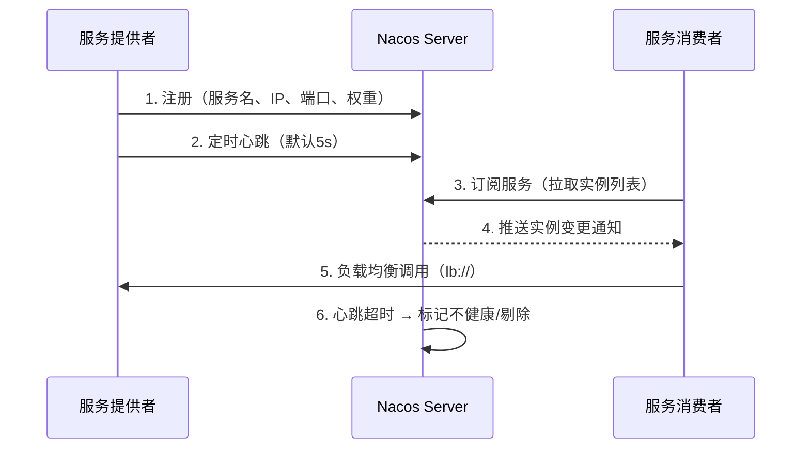
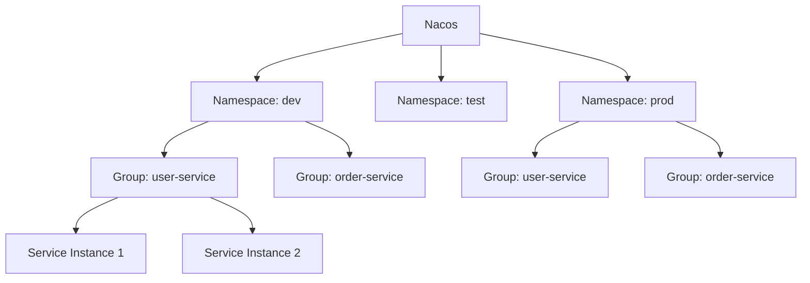
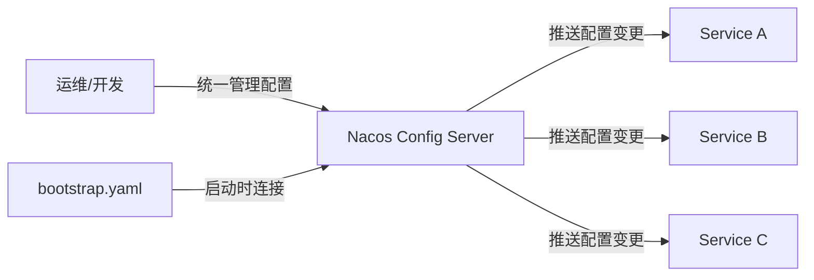

# Nacos 核心概念

**概述：** Nacos（Dynamic ==Naming== and ==Configuration== Service）是阿里巴巴开源的服务发现、配置管理和服务管理平台，主要解决微服务架构中服务寻址与配置分散两大核心问题。它将 ==注册中心==（替代 Eureka/Consul）与 ==配置中心==（替代 Spring Cloud Config）合二为一，降低了基础设施复杂度。

**概述：** Nacos 四大核心功能：

- **服务发现与注册** — 支持基于 DNS 和 RPC 的服务发现，实例启动时将元数据（IP、端口、权重等）注册到 Nacos，消费者通过服务名获取可用实例列表
- **配置管理** — 集中管理应用配置，支持 Properties、YAML、JSON 等格式，配置变更后实时推送，==无需重启==应用
- **动态 DNS** — 提供域名到 IP 的解析，支持动态更新和负载均衡，简化服务间调用
- **服务管理** — 生命周期管理、权重调整、动态上下线，方便运维操作

## 架构模型：AP 与 CP

**概述：** Nacos 同时支持 ==AP==（可用性优先）和 ==CP==（一致性优先）两种模式。临时实例（ephemeral，默认）采用 AP 模式，基于 Distro 协议，适合高频变化的微服务实例；持久实例（persistent）采用 CP 模式，基于 Raft 协议，适合数据库、中间件等需要强一致的场景。通过 `spring.cloud.nacos.discovery.ephemeral` 配置切换。

## 优势

**概述：** 与同类产品对比，Nacos 的核心优势：

|       特性        |     Nacos     | Eureka |  Consul  |
| :-------------: | :-----------: | :----: | :------: |
|      配置中心       |      内置       |   无    |    有限    |
|      一致性协议      |  AP + CP 可切换  |  仅 AP  | CP（Raft） |
|      健康检查       | 客户端心跳 + 服务端探测 | 仅客户端心跳 |   多种方式   |
|       控制台       |     完整可视化     |   简单   |    完整    |
| Spring Cloud 集成 |      无缝       |   原生   |   需适配    |

# 服务注册与发现

**概述：** 服务注册与发现是微服务架构的基石。服务提供者启动时向 Nacos 注册自身元数据，服务消费者通过服务名从 Nacos 获取实例列表，结合负载均衡策略选择目标实例发起调用。整个过程对业务代码透明。



## 健康检查机制

**概述：** Nacos 对临时实例采用 ==客户端心跳== 模式：实例每 5 秒发送心跳，15 秒未收到标记为不健康，30 秒未收到直接剔除。对持久实例采用 ==服务端主动探测== 模式：Nacos 定期对实例发起 TCP/HTTP 探测，探测失败标记为不健康但不会剔除。两种模式确保只有健康实例参与服务调用。

## OpenFeign 服务调用

**概述：** Nacos 注册中心完全兼容 Spring Cloud 的服务调用体系。使用 `@EnableFeignClients` 启用 OpenFeign 后，通过 `@FeignClient(name = "服务名")` 声明远程接口，底层自动从 Nacos 获取实例列表并通过 LoadBalancer 进行负载均衡调用，使用方式与 Eureka + Feign 完全一致。

# 命名空间与分组

**概述：** Nacos 通过 ==Namespace==（命名空间）和 ==Group==（分组）两级维度组织和隔离服务与配置。二者配合使用，可满足多环境隔离、多租户管理、业务模块划分等需求。



## 命名空间（Namespace）

**概述：** 命名空间提供 ==强隔离==，不同命名空间中的服务和配置互不可见。典型用途是环境隔离（dev/test/prod）和多租户隔离。每个命名空间有唯一 ID，在配置中通过 `namespace` 字段指定。默认命名空间为 `public`。

```yaml
spring:
  cloud:
    nacos:
      discovery:
        namespace: your-namespace-id  # 命名空间ID，非名称
```

## 分组（Group）

**概述：** 分组是同一命名空间内的 ==逻辑分类==，同组服务可互相发现，不同分组间默认不可见。典型用途是业务模块划分或服务版本管理。默认分组为 `DEFAULT_GROUP`。

```yaml
spring:
  cloud:
    nacos:
      discovery:
        group: YOUR_GROUP_NAME
```

## 对比与选择

**概述：** 核心区别在于隔离强度和层级：

| 维度 | Namespace | Group |
| :---: | :---: | :---: |
| 隔离强度 | 强隔离，互不可见 | 逻辑分类，同命名空间可访问 |
| 层级 | 更高层级 | 命名空间内的细分 |
| 典型用途 | 环境隔离、租户隔离 | 业务模块、版本管理 |
| 默认值 | `public` | `DEFAULT_GROUP` |

实际开发中，通常只创建少量命名空间（dev/test/prod），分组则按需使用。大多数团队在实际项目中不会做过于精细的分组划分。

# Nacos Config 配置中心

**概述：** 微服务架构下配置面临三大问题：==分散==（每个服务各自管理）、==无法区分环境==（dev/test/prod 配置混杂）、==无法实时更新==（修改后需重启）。Nacos Config 通过集中存储、环境隔离、动态推送三大机制一次性解决这些问题。



## DataId 命名规则

**概述：** DataId 是 Nacos 中配置集的唯一标识，拼接格式为：

```
${prefix}-${spring.profiles.active}.${file-extension}
```

- **prefix** — 默认取 `spring.application.name`，可通过 `spring.cloud.nacos.config.prefix` 自定义
- **spring.profiles.active** — 当前激活的环境 profile（如 `dev`、`test`、`prod`）
- **file-extension** — 配置格式，支持 `properties` 和 `yaml`

例如：应用名 `buy-gateway`，激活 `dev` 环境，格式 `yaml` → DataId 为 `buy-gateway-dev.yaml`。

## bootstrap.yaml 加载机制

**概述：** `bootstrap.yaml` 在 Spring 应用上下文启动 ==最早阶段== 加载，先于 `application.yaml`。它的核心职责是告诉应用去哪里拉取配置——即连接 Nacos Config Server 的地址、命名空间、认证信息等。当使用 Nacos Config 后，业务配置全部存储在 Nacos 中，本地的 `application.yaml` 可以删除或仅保留少量覆盖项。

加载顺序：`bootstrap.yaml` → Nacos Config 远程配置 → `application.yaml`（本地覆盖）。

## 配置共享

**概述：** 当多个服务需要相同配置时（如数据库连接、公共参数），可通过 `shared-configs` 引用已有的配置集，避免重复配置。每个 shared-config 条目需指定 `data-id`、`group`，以及是否开启 `refresh`（动态刷新）。

```yaml
spring:
  cloud:
    nacos:
      config:
        shared-configs:
          - data-id: common-db.yaml
            group: DEFAULT_GROUP
            refresh: true  # 配置变更时动态刷新
```

**概述：** 共享配置的典型策略是将各服务的端口等差异化配置保留在各自的 `bootstrap.yaml` 中，将公共配置（数据源、MyBatis、日志等）提取到共享配置集中。优先级：服务自身配置 > shared-configs > extension-configs。

# Spring Boot 多环境配置

**概述：** Spring Boot 通过 ==Profile== 机制支持多环境配置。配置文件命名格式为 `application-{profile}.yaml`，通过 `spring.profiles.active` 指定激活的环境。结合 Nacos Config 后，多环境管理更加灵活——每个环境对应一个 Namespace，DataId 中的 profile 后缀自动匹配对应的配置集。

```
src/resources/
├── application.yaml           # 通用配置
├── application-dev.yaml       # 开发环境
├── application-test.yaml      # 测试环境
└── application-prod.yaml      # 生产环境
```

**概述：** 激活方式有三种：配置文件中 `spring.profiles.active=dev`、JVM 参数 `-Dspring.profiles.active=dev`、环境变量 `SPRING_PROFILES_ACTIVE=dev`。当使用 Nacos Config 时，推荐在 `bootstrap.yaml` 中设置 `spring.profiles.active`，由 Nacos 根据 DataId 自动加载对应环境的配置。

## Further Reading

- [Nacos 官方文档](https://nacos.io/docs/latest/what-is-nacos/)
- [Spring Cloud Alibaba Nacos Discovery](https://sca.aliyun.com/docs/2021/user-guide/nacos/quick-start/)
- [Spring Cloud Alibaba Nacos Config](https://sca.aliyun.com/docs/2021/user-guide/nacos/advanced-guide/)
- [Nacos GitHub 仓库](https://github.com/alibaba/nacos)
- [Spring Boot Profiles 官方文档](https://docs.spring.io/spring-boot/docs/current/reference/html/features.html#features.profiles)
