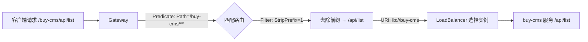

# 父工程依赖配置

**概述：** 使用 Nacos 作为注册中心前，需在父工程 `pom.xml` 的 `<dependencyManagement>` 中统一引入 Spring Cloud 和 Spring Cloud Alibaba 的 BOM（Bill of Materials），确保子模块版本一致。

```xml
<dependencyManagement>
    <dependencies>
        <!-- Spring Boot -->
        <dependency>
            <groupId>org.springframework.boot</groupId>
            <artifactId>spring-boot-dependencies</artifactId>
            <version>2.7.6</version>
            <type>pom</type>
            <scope>import</scope>
        </dependency>

        <!-- Spring Cloud -->
        <dependency>
            <groupId>org.springframework.cloud</groupId>
            <artifactId>spring-cloud-dependencies</artifactId>
            <version>2021.0.3</version>
            <type>pom</type>
            <scope>import</scope>
        </dependency>

        <!-- Spring Cloud Alibaba -->
        <dependency>
            <groupId>com.alibaba.cloud</groupId>
            <artifactId>spring-cloud-alibaba-dependencies</artifactId>
            <version>2021.0.5.0</version>
            <type>pom</type>
            <scope>import</scope>
        </dependency>
    </dependencies>
</dependencyManagement>
```

# 子模块服务注册

## 引入依赖

**概述：** 在需要注册到 Nacos 的子模块 `pom.xml` 中添加 Nacos Discovery 依赖：

```xml
<dependency>
    <groupId>com.alibaba.cloud</groupId>
    <artifactId>spring-cloud-starter-alibaba-nacos-discovery</artifactId>
</dependency>
```

> **注意：** 版本号由父工程 BOM 管理，子模块中==不要==指定 `<version>`。

## application.yaml 配置

**概述：** 在子模块的 `application.yaml` 中配置 Nacos 连接信息：

```yaml
server:
  port: 8081

spring:
  application:
    name: buy-cms  # 注册到 Nacos 的服务名，其他服务通过此名调用
  cloud:
    nacos:
      discovery:
        server-addr: localhost:8848       # Nacos Server 地址
        service: ${spring.application.name}
        username: nacos                   # 认证用户名
        password: nacos                   # 认证密码
        namespace: your-namespace-id      # 命名空间ID（可选，默认 public）
        group: DEFAULT_GROUP              # 分组（可选，默认 DEFAULT_GROUP）
```

**概述：** 关键配置项说明：

| 配置项 | 说明 | 默认值 |
| :--- | :--- | :---: |
| `server-addr` | Nacos Server 地址，集群用逗号分隔 | 无（必填） |
| `service` | 注册的服务名 | `${spring.application.name}` |
| `namespace` | 命名空间 ID（==注意是 ID 不是名称==） | `public` |
| `group` | 分组名称 | `DEFAULT_GROUP` |
| `ephemeral` | 是否为临时实例 | `true` |
| `weight` | 实例权重（0~10000） | `1` |

## 启动类注解

**概述：** 在启动类添加 `@EnableDiscoveryClient` 注解，启用服务注册与发现功能：

```java
@SpringBootApplication
@EnableDiscoveryClient
public class BuyCmsApplication {
    public static void main(String[] args) {
        SpringApplication.run(BuyCmsApplication.class, args);
    }
}
```

> **提示：** Spring Cloud 2020+ 版本中，`@EnableDiscoveryClient` 可省略，引入依赖后自动启用。但显式添加可提高代码可读性。

## 验证注册

**概述：** 启动应用后，打开 Nacos 控制台 → 服务管理 → 服务列表，确认对应命名空间下出现该服务，实例数为 1，健康状态为绿色。也可通过 Nacos Open API 验证：

```bash
curl "http://localhost:8848/nacos/v1/ns/instance/list?serviceName=buy-cms"
```

# Spring Cloud Gateway 配置

## 引入依赖

**概述：** Gateway 模块需引入 Gateway Starter 和 LoadBalancer（==必须==引入，否则 `lb://` 路由不生效）：

```xml
<dependency>
    <groupId>org.springframework.cloud</groupId>
    <artifactId>spring-cloud-starter-gateway</artifactId>
    <exclusions>
        <!-- Gateway 基于 WebFlux，必须排除 spring-boot-starter-web -->
        <exclusion>
            <groupId>org.springframework.boot</groupId>
            <artifactId>spring-boot-starter-web</artifactId>
        </exclusion>
    </exclusions>
</dependency>

<dependency>
    <groupId>org.springframework.cloud</groupId>
    <artifactId>spring-cloud-starter-loadbalancer</artifactId>
</dependency>
```

## 路由配置

**概述：** 在 Gateway 的 `application.yaml` 中配置路由规则，将请求转发到 Nacos 中注册的服务：

```yaml
server:
  port: 8888

spring:
  application:
    name: buy-gateway
  cloud:
    nacos:
      discovery:
        server-addr: localhost:8848
        service: ${spring.application.name}
        username: nacos
        password: nacos
        namespace: your-namespace-id
    gateway:
      routes:
        - id: buy-cms                    # 路由 ID，自定义
          uri: lb://buy-cms              # lb:// 表示从注册中心负载均衡
          predicates:
            - Path=/buy-cms/**           # 匹配路径前缀
          filters:
            - StripPrefix=1              # 去除第一级路径前缀

        - id: buy-manager
          uri: lb://buy-manager
          predicates:
            - Path=/buy-manager/**
          filters:
            - StripPrefix=1
```

**概述：** 路由核心三要素：



- **Predicate**（断言）— 匹配条件，决定请求是否走该路由
- **Filter**（过滤器）— 对请求/响应进行修改，如 `StripPrefix=1` 去除路径前缀
- **URI** — 目标地址，`lb://` 前缀表示从注册中心获取实例

## Further Reading

- [Spring Cloud Alibaba Nacos Discovery](https://sca.aliyun.com/docs/2021/user-guide/nacos/quick-start/)
- [Spring Cloud Gateway 官方文档](https://docs.spring.io/spring-cloud-gateway/docs/current/reference/html/)
- [Spring Cloud LoadBalancer](https://docs.spring.io/spring-cloud-commons/docs/current/reference/html/#spring-cloud-loadbalancer)
