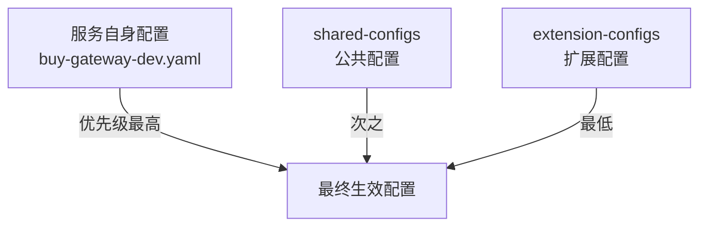

# 引入依赖

**概述：** 使用 Nacos Config 作为配置中心需引入两个依赖：`spring-cloud-starter-bootstrap`（启用 bootstrap.yaml 加载机制）和 `spring-cloud-starter-alibaba-nacos-config`（Nacos Config 客户端）。

```xml
<!-- 启用 bootstrap.yaml 支持（Spring Cloud 2021+ 必须显式引入） -->
<dependency>
    <groupId>org.springframework.cloud</groupId>
    <artifactId>spring-cloud-starter-bootstrap</artifactId>
</dependency>

<!-- Nacos Config 客户端 -->
<dependency>
    <groupId>com.alibaba.cloud</groupId>
    <artifactId>spring-cloud-starter-alibaba-nacos-config</artifactId>
</dependency>
```

> **注意：** Spring Cloud 2021+ 默认不加载 `bootstrap.yaml`，==必须==显式引入 `spring-cloud-starter-bootstrap`，否则无法连接 Nacos Config。

# bootstrap.yaml 配置

**概述：** `bootstrap.yaml` 是连接 Nacos Config Server 的入口配置，在应用启动最早阶段加载。核心配置项包括 Nacos 地址、认证信息、命名空间和配置格式。

```yaml
spring:
  application:
    name: buy-gateway              # 对应 DataId 的 prefix
  cloud:
    nacos:
      config:
        server-addr: localhost:8848  # Nacos Server 地址
        username: nacos
        password: nacos
        namespace: your-namespace-id # 命名空间ID
        file-extension: yaml         # 配置格式：yaml 或 properties
        group: DEFAULT_GROUP         # 分组（可选）
  profiles:
    active: dev                      # 激活的环境 profile
```

**概述：** 关键配置项详解：

| 配置项 | 说明 | 示例 |
| :--- | :--- | :---: |
| `spring.application.name` | DataId 前缀 | `buy-gateway` |
| `spring.profiles.active` | 环境 profile，拼入 DataId | `dev` |
| `file-extension` | 配置文件格式 | `yaml` |
| `namespace` | 命名空间 ID | UUID 格式 |
| `group` | 配置分组 | `DEFAULT_GROUP` |

**概述：** 以上配置拼接出的 DataId 为：`buy-gateway-dev.yaml`。Nacos Config 客户端启动时会自动从指定命名空间和分组中拉取该 DataId 对应的配置。

# Nacos 控制台创建配置

**概述：** 在 Nacos 控制台操作步骤：

1. 进入 **配置管理** → **配置列表**
2. 选择目标命名空间（如 dev）
3. 点击 **+** 创建配置
4. 填写 **Data ID**（如 `buy-gateway-dev.yaml`）、**Group**（如 `DEFAULT_GROUP`）
5. 选择配置格式（YAML）
6. 填写配置内容并发布


# 远程配置内容示例

**概述：** 将原本 `application.yaml` 中的全部业务配置迁移到 Nacos 中管理。以 Gateway 模块为例，在 Nacos 中创建 `buy-gateway-dev.yaml`：

```yaml
server:
  port: 8888

spring:
  application:
    name: buy-gateway
  cloud:
    nacos:
      discovery:
        server-addr: localhost:8848
        service: ${spring.application.name}
        username: nacos
        password: nacos
        namespace: your-namespace-id
    gateway:
      routes:
        - id: buy-cms
          uri: lb://buy-cms
          predicates:
            - Path=/buy-cms/**
          filters:
            - StripPrefix=1
```

**概述：** 配置迁移到 Nacos 后，本地的 `application.yaml` 可以删除或注释掉。应用启动时通过 `bootstrap.yaml` 连接 Nacos，自动拉取远程配置。

# 配置共享（shared-configs）

**概述：** 当多个服务共用相同配置（如数据源、公共参数）时，使用 `shared-configs` 引用已有配置集，避免重复维护。典型场景：将端口等差异化配置保留在各自的 `bootstrap.yaml` 中，公共配置提取到 Nacos 共享。

```yaml
spring:
  application:
    name: web2
  cloud:
    nacos:
      config:
        server-addr: localhost:8848
        username: nacos
        password: nacos
        namespace: your-namespace-id
        file-extension: yaml
        group: web
        shared-configs:
          - data-id: web-dev.yaml      # 共享的配置 DataId
            group: web                  # 共享配置所在分组
            refresh: true               # 配置变更时自动刷新
  profiles:
    active: dev
```

**概述：** 配置优先级（由高到低）：



1. **服务自身配置**（`${prefix}-${profile}.${extension}`）— 优先级最高
2. **shared-configs** — 多个 shared-config 之间，==后声明的优先级更高==
3. **extension-configs** — 优先级最低

# 动态刷新配置

**概述：** Nacos Config 支持配置变更后 ==实时推送== 到客户端。默认使用长轮询机制（30s 超时），配置变更后客户端通常在 1~2 秒内感知。在需要动态刷新的 Bean 上添加 `@RefreshScope` 注解：

```java
@RestController
@RefreshScope
public class ConfigController {

    @Value("${custom.config.key:default}")
    private String configValue;

    @GetMapping("/config")
    public String getConfig() {
        return configValue;
    }
}
```

**概述：** 在 Nacos 控制台修改配置并发布后，`configValue` 的值会自动更新，==无需重启应用==。

## Further Reading

- [Nacos Config 快速开始](https://sca.aliyun.com/docs/2021/user-guide/nacos/quick-start/)
- [Nacos Config 进阶指南](https://sca.aliyun.com/docs/2021/user-guide/nacos/advanced-guide/)
- [Spring Cloud Bootstrap 配置](https://docs.spring.io/spring-cloud-commons/docs/current/reference/html/#the-bootstrap-application-context)
- [Nacos 配置管理最佳实践](https://nacos.io/docs/latest/guide/user/open-api/)
