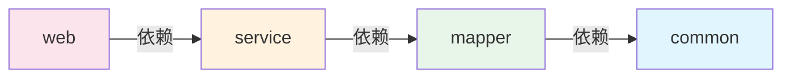

# 父项目 POM 配置

**概述：** 父项目的 `pom.xml` 是多模块项目的配置中枢。`<packaging>` 必须设为 `pom`（非 jar/war），通过 `<modules>` 声明所有子模块，通过 `<dependencyManagement>` 统一管理依赖版本。

```xml
<?xml version="1.0" encoding="UTF-8"?>
<project xmlns="http://maven.apache.org/POM/4.0.0"
         xmlns:xsi="http://www.w3.org/2001/XMLSchema-instance"
         xsi:schemaLocation="http://maven.apache.org/POM/4.0.0
         http://maven.apache.org/xsd/maven-4.0.0.xsd">
    <modelVersion>4.0.0</modelVersion>

    <parent>
        <groupId>org.springframework.boot</groupId>
        <artifactId>spring-boot-starter-parent</artifactId>
        <version>2.6.13</version>
    </parent>

    <groupId>com.example</groupId>
    <artifactId>parent-project</artifactId>
    <version>1.0.0</version>
    <packaging>pom</packaging>

    <!-- 声明所有子模块 -->
    <modules>
        <module>common</module>
        <module>mapper</module>
        <module>service</module>
        <module>web</module>
    </modules>

    <!-- 统一版本号管理 -->
    <properties>
        <java.version>11</java.version>
        <mybatis-plus.version>3.5.2</mybatis-plus.version>
    </properties>

    <!-- 依赖版本声明（不实际引入） -->
    <dependencyManagement>
        <dependencies>
            <!-- Spring Cloud 版本管理 -->
            <dependency>
                <groupId>org.springframework.cloud</groupId>
                <artifactId>spring-cloud-dependencies</artifactId>
                <version>2021.0.3</version>
                <type>pom</type>
                <scope>import</scope>
            </dependency>
            <!-- 子模块自身 -->
            <dependency>
                <groupId>com.example</groupId>
                <artifactId>common</artifactId>
                <version>${project.version}</version>
            </dependency>
            <dependency>
                <groupId>com.example</groupId>
                <artifactId>mapper</artifactId>
                <version>${project.version}</version>
            </dependency>
            <dependency>
                <groupId>com.example</groupId>
                <artifactId>service</artifactId>
                <version>${project.version}</version>
            </dependency>
        </dependencies>
    </dependencyManagement>
</project>
```

# 子模块 POM 配置

**概述：** 每个子模块的 `pom.xml` 通过 `<parent>` 指向父项目，引入依赖时==无需指定版本号==（从父项目 `dependencyManagement` 继承）。子模块应删除从父项目继承的冗余 `spring-boot-starter` 依赖。

## common 模块

```xml
<project>
    <parent>
        <groupId>com.example</groupId>
        <artifactId>parent-project</artifactId>
        <version>1.0.0</version>
    </parent>

    <artifactId>common</artifactId>

    <dependencies>
        <!-- 公共依赖：实体类注解、工具类等 -->
        <dependency>
            <groupId>org.projectlombok</groupId>
            <artifactId>lombok</artifactId>
        </dependency>
    </dependencies>
</project>
```

## mapper 模块

```xml
<project>
    <parent>
        <groupId>com.example</groupId>
        <artifactId>parent-project</artifactId>
        <version>1.0.0</version>
    </parent>

    <artifactId>mapper</artifactId>

    <dependencies>
        <!-- 引入 common（传递实体类等） -->
        <dependency>
            <groupId>com.example</groupId>
            <artifactId>common</artifactId>
        </dependency>
        <dependency>
            <groupId>com.baomidou</groupId>
            <artifactId>mybatis-plus-boot-starter</artifactId>
        </dependency>
    </dependencies>
</project>
```

## service 模块

**概述：** service 引入 mapper 后，Maven ==依赖传递==机制会自动获得 mapper 所依赖的 common，无需重复声明。

```xml
<project>
    <parent>
        <groupId>com.example</groupId>
        <artifactId>parent-project</artifactId>
        <version>1.0.0</version>
    </parent>

    <artifactId>service</artifactId>

    <dependencies>
        <!-- 引入 mapper（自动传递 common） -->
        <dependency>
            <groupId>com.example</groupId>
            <artifactId>mapper</artifactId>
        </dependency>
    </dependencies>
</project>
```

## web 模块

```xml
<project>
    <parent>
        <groupId>com.example</groupId>
        <artifactId>parent-project</artifactId>
        <version>1.0.0</version>
    </parent>

    <artifactId>web</artifactId>

    <dependencies>
        <!-- 引入 service（自动传递 mapper → common） -->
        <dependency>
            <groupId>com.example</groupId>
            <artifactId>service</artifactId>
        </dependency>
        <dependency>
            <groupId>org.springframework.boot</groupId>
            <artifactId>spring-boot-starter-web</artifactId>
        </dependency>
    </dependencies>
</project>
```



# 启动类配置

**概述：** 多模块项目中，启动类位于 web 模块。由于各模块的包名可能不同，需要通过 `@ComponentScan` 显式指定扫描路径，确保 Spring 能发现其他模块中的 Bean。`@MapperScan` 指定 Mapper 接口所在包。

```java
@SpringBootApplication
@MapperScan("com.example.mapper")
@ComponentScan(basePackages = {
    "com.example.common",
    "com.example.mapper",
    "com.example.service",
    "com.example.web"
})
public class WebApplication {
    public static void main(String[] args) {
        SpringApplication.run(WebApplication.class, args);
    }
}
```

# application.yml 配置

**概述：** 应用配置文件放在 web 模块的 `src/main/resources` 下，包含数据源、MyBatis-Plus、端口等配置。

```yaml
server:
  port: 8082

spring:
  datasource:
    driver-class-name: com.mysql.cj.jdbc.Driver
    url: jdbc:mysql://localhost:3306/mydb?serverTimezone=Asia/Shanghai&useUnicode=true&characterEncoding=utf-8&useSSL=false&allowPublicKeyRetrieval=true
    username: root
    password: root
    hikari:
      connection-timeout: 6000
      maximum-pool-size: 5

mybatis-plus:
  configuration:
    map-underscore-to-camel-case: true
    auto-mapping-behavior: full
    log-impl: org.apache.ibatis.logging.stdout.StdOutImpl
  mapper-locations: classpath*:mapping/*Mapper.xml
  global-config:
    db-config:
      logic-not-delete-value: 1
      logic-delete-value: 0
```

## Further Reading

- [Maven 多模块项目指南](https://maven.apache.org/guides/mini/guide-multiple-modules.html)
- [Maven dependencyManagement 文档](https://maven.apache.org/guides/introduction/introduction-to-dependency-mechanism.html#dependency-management)
- [Spring Boot 多模块项目最佳实践](https://spring.io/guides/gs/multi-module)
- [MyBatis-Plus 官方文档](https://baomidou.com/pages/24112f/)
