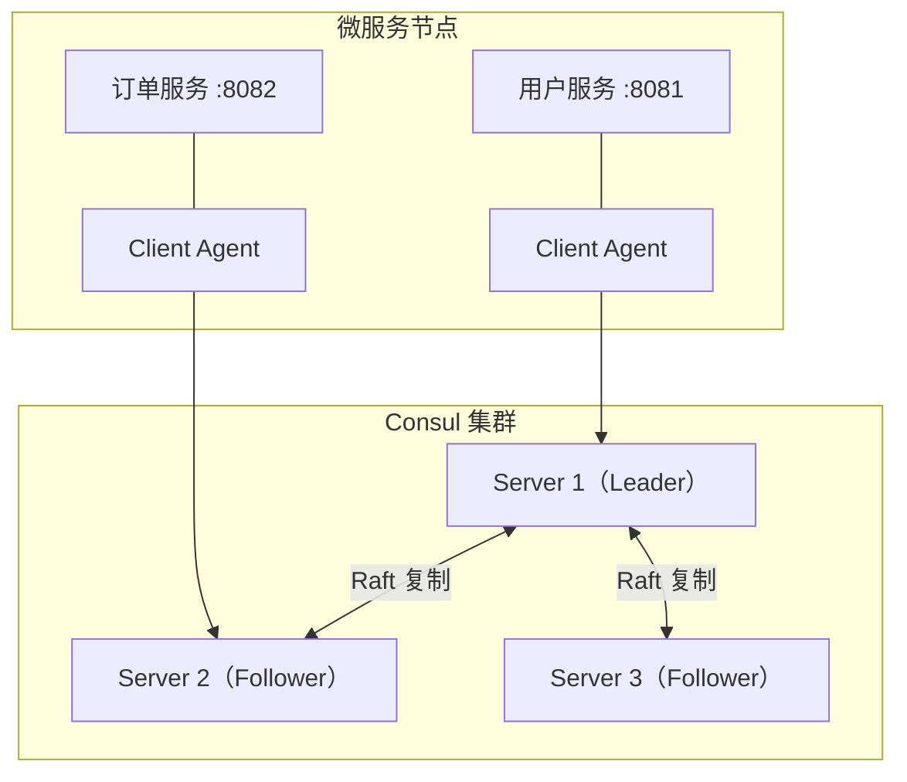
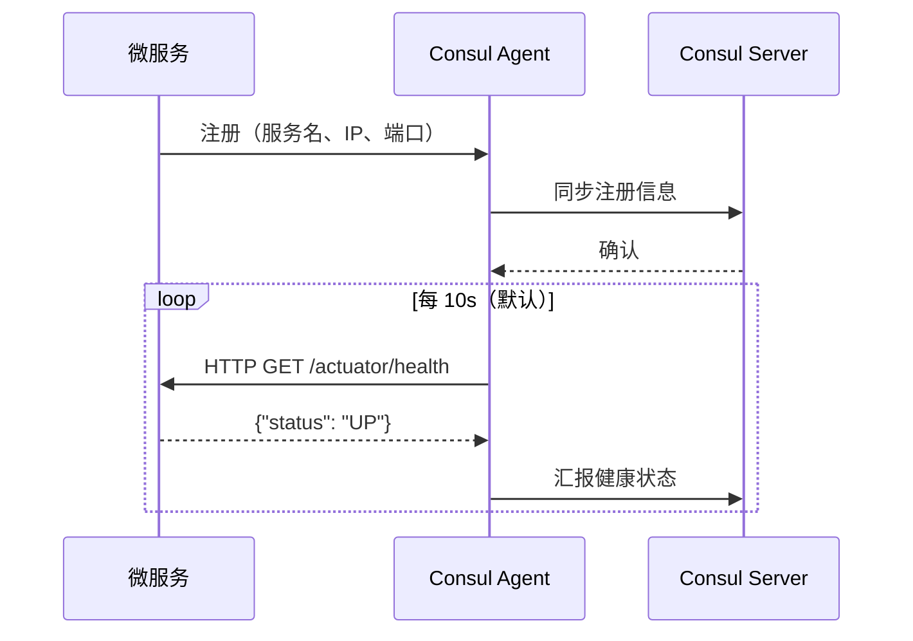
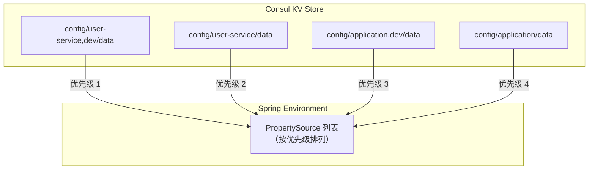
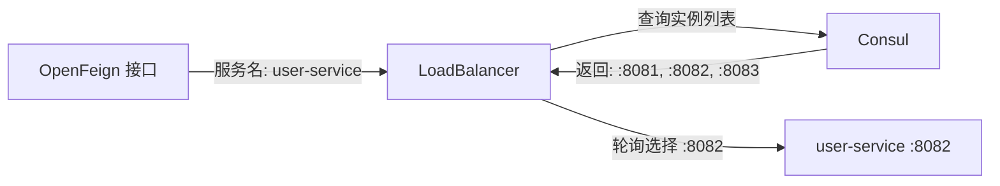

# 服务治理概述

**概述：** 在微服务架构中，服务实例的数量和地址是动态变化的（水平扩缩容、故障重启、滚动发布），硬编码 IP:Port 的调用方式不可维护。==服务治理==（Service Governance）通过注册中心统一管理服务实例的生命周期，解决"服务在哪里"和"服务是否可用"两个核心问题。

**概述：** 主流注册中心对比：

| 特性 | Consul | Eureka | Nacos | Zookeeper |
|------|--------|--------|-------|-----------|
| 开发语言 | Go | Java | Java | Java |
| CAP 模型 | ==CP==（强一致） | AP（最终一致） | AP/CP 可切换 | CP |
| 健康检查 | HTTP/TCP/Script/gRPC | 心跳 | 心跳/HTTP | 会话保持 |
| 配置中心 | ==内置 KV Store== | 无 | 内置 | 无 |
| 多数据中心 | 原生支持 | 不支持 | 支持 | 不支持 |
| 管理界面 | 内置 Web UI | 内置 | 内置 | 第三方 |
| 维护状态 | 活跃 | ==已停更==（2.x） | 活跃 | 活跃 |

**概述：** Consul 是 HashiCorp 开发的==一站式服务治理方案==，集服务注册发现、健康检查、KV 配置中心、多数据中心于一体，无需额外组件。Spring Cloud 官方推荐用 Consul 替代已停更的 Eureka。

# Consul 架构

**概述：** Consul 采用 Agent 架构，每个节点运行一个 Consul Agent，Agent 分为 ==Server== 和 ==Client== 两种模式。Server 负责存储数据和处理查询，通过 ==Raft 协议==保证数据强一致性；Client 是无状态的轻量代理，将请求转发给 Server。



**概述：** Raft 协议要求集群中 Server 节点数为==奇数==（推荐 3 或 5 个），通过选举产生 Leader。写操作必须经 Leader 同步到多数 Follower 后才返回成功，保证了==强一致性==（CP）。这意味着在网络分区时，少数派分区的节点无法提供写服务——这是 CP 模型的固有取舍。

# 服务注册与发现

## 注册机制

**概述：** 微服务启动时，通过 `spring-cloud-starter-consul-discovery` 自动向 Consul 注册自身的元数据：==服务名==（`spring.application.name`）、IP、端口、健康检查 URL 等。Consul 维护一张实时的==服务目录==（Service Catalog），记录每个服务的所有活跃实例。



**概述：** 注册的关键参数：

| 参数 | 说明 | 默认值 |
|------|------|-------|
| `service-name` | 注册到 Consul 的服务名 | `${spring.application.name}` |
| `instance-id` | 实例唯一标识 | `服务名-端口` |
| `prefer-ip-address` | 注册时使用 IP 而非主机名 | `false` |
| `ip-address` | 显式指定注册 IP | 自动探测 |

## 发现机制

**概述：** 服务消费方通过==服务名==（而非 IP:Port）查找目标服务。Consul 返回该服务所有健康实例的列表，消费方再通过负载均衡器（如 Spring Cloud LoadBalancer）选择一个实例发起调用。

```java
@Autowired
private DiscoveryClient discoveryClient;

public List<ServiceInstance> getInstances() {
    return discoveryClient.getInstances("user-service");
}
```

**概述：** `DiscoveryClient` 是 Spring Cloud 提供的==服务发现抽象接口==，底层由 `spring-cloud-starter-consul-discovery` 实现。在实际项目中，很少直接使用 `DiscoveryClient`，而是通过 ==OpenFeign== 或 ==RestTemplate + @LoadBalanced== 间接使用，它们内部自动完成服务发现和负载均衡。

# 健康检查

**概述：** 健康检查是 Consul 判断服务实例是否可用的核心机制。Consul Agent 定期向已注册实例发送探测请求，根据响应结果标记实例状态：==passing==（健康）、==warning==（警告）、==critical==（不可用，从服务目录中移除）。

**概述：** Spring Cloud Consul 默认注册一个 ==HTTP 健康检查==，Consul Agent 每 10 秒访问一次应用的 `/actuator/health` 端点。该端点由 Spring Boot Actuator 提供，它聚合所有 `HealthIndicator` Bean（数据源、Redis、磁盘空间等）的状态，返回综合健康状态。

```mermaid
flowchart LR
    CA["Consul Agent"] -->|"HTTP GET"| AH["/actuator/health"]
    subgraph "Spring Boot Actuator"
        AH --> HI1["DataSourceHealthIndicator"]
        AH --> HI2["DiskSpaceHealthIndicator"]
        AH --> HI3["RedisHealthIndicator"]
        AH --> HI4["..."]
    end
    AH -->|'{"status":"UP"}'| CA
    CA -->|"汇报状态"| CS["Consul Server"]
```

**概述：** 健康检查的关键注意点：

- Spring Boot 2.x 的 Actuator 端点路径为 `/actuator/health`（1.x 为 `/health`），需确保 `healthCheckPath` 配置正确
- 如果应用依赖了 Redis/MySQL 但未启动对应服务，Actuator 会返回 `DOWN`，导致 Consul 将实例标记为 ==critical==
- 生产环境应合理配置 `healthCheckInterval`（过短增加网络开销，过长延迟故障感知）
- 可通过 `management.health.consul.enabled=false` 禁用 Consul 自身的 HealthIndicator

## 健康检查类型

**概述：** Consul 支持多种健康检查方式，Spring Cloud 默认使用 HTTP，但 Consul 原生还支持：

| 类型 | 原理 | 适用场景 |
|------|------|---------|
| **HTTP** | 发送 HTTP GET，2xx 为健康 | ==Web 应用（默认）== |
| **TCP** | 尝试 TCP 连接，连通即健康 | 非 HTTP 服务 |
| **Script** | 执行脚本，退出码 0 为健康 | 自定义检查逻辑 |
| **TTL** | 服务主动上报，超时未上报即不健康 | 无法被动探测的服务 |
| **gRPC** | gRPC 健康检查协议 | gRPC 服务 |

# KV 配置中心

**概述：** Consul 内置的 ==Key/Value Store== 可作为分布式配置中心，替代 Spring Cloud Config + Git 的方案。优势在于：==无需 Git 仓库==、==无需消息总线（Bus）即可动态刷新==、与服务注册使用同一个 Consul 集群，运维复杂度低。

## 配置加载机制

**概述：** Spring Cloud Consul Config 在应用启动的 ==bootstrap 阶段==从 Consul KV 中加载配置，注入到 Spring Environment。配置的查找遵循==优先级从高到低==的规则：

```
config/{应用名},{profile}/data
config/{应用名}/data
config/application,{profile}/data
config/application/data
```

**概述：** 例如应用名为 `user-service`、profile 为 `dev` 时，查找顺序为：

1. `config/user-service,dev/data` — 当前应用 + 当前环境（==最高优先级==）
2. `config/user-service/data` — 当前应用默认配置
3. `config/application,dev/data` — 全局 dev 环境配置
4. `config/application/data` — 全局默认配置（==最低优先级==）



## 在 Consul UI 中添加配置

**概述：** 通过 Consul Web UI（`http://localhost:8500`）的 Key/Value 菜单手动添加配置。创建 Key 时路径格式为 `config/{应用名}/data`，Value 填入 YAML 或 Properties 格式的配置内容。

```yaml
# 在 Consul KV 中存储（Key: config/user-service/data）
server:
  port: 8081
custom:
  message: "Hello from Consul KV"
  max-retry: 3
```

## 动态刷新

**概述：** Consul Config Watch 通过==阻塞式 HTTP 长轮询==监听 KV 变更。当配置发生变化时，自动发布 `RefreshEvent`，等同于调用 `/actuator/refresh` 端点。==无需 Spring Cloud Bus==，Consul 原生支持配置热加载。

**概述：** 使用 `@RefreshScope` 注解标记需要动态刷新的 Bean，配置变更时 Spring 会销毁旧实例并创建新实例，注入最新配置值：

```java
@RestController
@RefreshScope
public class ConfigController {

    @Value("${custom.message:默认值}")
    private String message;

    @GetMapping("/config")
    public String getConfig() {
        return message;
    }
}
```

**概述：** 配置修改后==无需重启应用==，Consul Watch 默认每 ==1000ms== 检查一次变更，可通过 `spring.cloud.consul.config.watch.delay` 调整。

# 负载均衡

**概述：** Consul 本身不提供客户端负载均衡，这一职责由 ==Spring Cloud LoadBalancer==（替代已停更的 Ribbon）承担。当通过 OpenFeign 或 `@LoadBalanced RestTemplate` 调用服务时，LoadBalancer 从 Consul 获取实例列表，按策略选择目标实例。

**概述：** 默认使用==轮询==（Round Robin）策略，可切换为随机策略：

```java
public class CustomLoadBalancerConfig {
    @Bean
    public ReactorLoadBalancer<ServiceInstance> randomLoadBalancer(
            Environment env, LoadBalancerClientFactory factory) {
        String name = env.getProperty(
            LoadBalancerClientFactory.PROPERTY_NAME);
        return new RandomLoadBalancer(
            factory.getLazyProvider(name,
                ServiceInstanceListSupplier.class), name);
    }
}
```



# 集群部署

**概述：** 生产环境 Consul 必须以集群模式运行（开发环境的 `-dev` 模式数据存内存，重启即丢失）。最低配置为 ==3 个 Server 节点==（容忍 1 个节点故障），推荐 5 个（容忍 2 个）。

```bash
# Server 节点 1（bootstrap 模式启动首个 Server）
consul agent -server -bootstrap-expect=3 \
  -data-dir=/opt/consul/data \
  -node=server-1 -bind=10.0.1.1 \
  -client=0.0.0.0 -ui

# Server 节点 2、3（加入集群）
consul agent -server -bootstrap-expect=3 \
  -data-dir=/opt/consul/data \
  -node=server-2 -bind=10.0.1.2 \
  -join=10.0.1.1

# Client 节点（运行在微服务所在机器）
consul agent -data-dir=/opt/consul/data \
  -node=client-1 -bind=10.0.2.1 \
  -join=10.0.1.1
```

**概述：** 集群关键参数：

| 参数 | 说明 |
|------|------|
| `-server` | 以 Server 模式运行 |
| `-bootstrap-expect=N` | 集群预期 Server 数，达到后自动选举 Leader |
| `-data-dir` | 数据持久化目录 |
| `-bind` | 集群内通信地址 |
| `-client` | 客户端接口监听地址，`0.0.0.0` 允许远程访问 |
| `-join` | 加入已有集群的节点地址 |
| `-ui` | 启用 Web UI |

# ACL 安全机制

**概述：** 生产环境必须启用 ==ACL==（Access Control List）控制对 Consul API 的访问权限。ACL 基于 Token 机制，每个 Token 关联一组策略（Policy），策略定义对服务注册、KV 读写、Agent 操作等资源的权限。

**概述：** ACL 初始化步骤：

1. 在 Consul 配置文件中启用 ACL 并设置默认策略为 `deny`
2. 执行 `consul acl bootstrap` 生成管理员 Token（==Master Token==）
3. 创建具体策略和 Token，分配给各微服务
4. 在 Spring Boot 配置中指定 Token

```yaml
spring:
  cloud:
    consul:
      discovery:
        acl-token: ${CONSUL_ACL_TOKEN}
      config:
        acl-token: ${CONSUL_ACL_TOKEN}
```

**概述：** ==永远不要在代码或配置文件中硬编码 Token==，应通过环境变量或密钥管理服务注入。

# 与其他方案对比

**概述：** 选择注册中心时需根据团队技术栈和具体需求权衡：

| 维度 | Consul | Nacos | Eureka |
|------|--------|-------|--------|
| 一致性模型 | CP（Raft） | AP/CP 可切换 | AP |
| 配置中心 | ==内置== | ==内置==（功能更丰富） | 无 |
| 生态整合 | HashiCorp 全家桶 | 阿里巴巴生态 | Netflix 生态（停更） |
| 运维复杂度 | 中（Go 二进制部署） | 低（Java 应用） | 低 |
| 适用场景 | 强一致性要求、多数据中心 | 国内项目、阿里云生态 | 存量 Netflix 栈项目 |

## Further Reading

- [Spring Cloud Consul 官方文档](https://docs.spring.io/spring-cloud-consul/reference/html/)
- [Spring Cloud Consul 中文文档](https://www.springcloud.cc/spring-cloud-consul.html)
- [Consul 官方文档](https://developer.hashicorp.com/consul/docs)
- [Consul 入门教程（2024）](https://www.techgrow.cn/posts/ce63e626.html)
- [Spring Cloud Consul Config 分布式配置](https://docs.spring.io/spring-cloud-consul/reference/config.html)
- [Consul ACL 系统文档](https://developer.hashicorp.com/consul/docs/security/acl)
