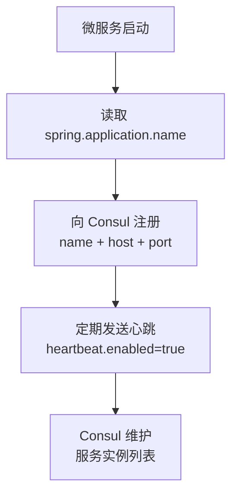

# 安装 Consul

**概述：** Consul 是 HashiCorp 提供的服务发现与配置管理工具，安装包为单个可执行文件，无需额外依赖。==版本需与 Spring Cloud 版本兼容==。

下载地址：

```
https://developer.hashicorp.com/consul/install
```

**概述：** 下载对应操作系统的压缩包，解压后得到一个 `consul`（或 `consul.exe`）可执行文件。建议将其放在固定目录并添加到系统 `PATH` 环境变量。

# 启动 Consul

**概述：** 开发环境使用 `-dev` 模式启动，该模式以单节点方式运行，数据存储在内存中（重启后丢失），适合本地开发和测试。

```bash
consul agent -dev
```

**概述：** 默认端口为 ==8500==，启动成功后访问 `http://localhost:8500` 可看到 Consul 的 Web UI 管理界面。界面中 "Services" 页面展示所有已注册的服务实例及其健康状态。


# Spring Cloud 版本依赖

**概述：** 在父项目的 `pom.xml` 中通过 `<dependencyManagement>` 引入 Spring Cloud BOM（Bill of Materials），统一管理所有 Spring Cloud 组件的版本号。==Spring Cloud 版本必须与 Spring Boot 版本对应==。

```xml
<dependencyManagement>
    <dependencies>
        <dependency>
            <groupId>org.springframework.cloud</groupId>
            <artifactId>spring-cloud-dependencies</artifactId>
            <version>2021.0.3</version>
            <type>pom</type>
            <scope>import</scope>
        </dependency>
    </dependencies>
</dependencyManagement>
```

| Spring Cloud 版本 | 对应 Spring Boot 版本 |
|-------------------|---------------------|
| 2021.0.x | 2.6.x |
| 2022.0.x | 3.0.x |
| 2023.0.x | 3.2.x / 3.3.x |

# Consul Discovery 依赖

**概述：** 在需要注册到 Consul 的模块中引入 `spring-cloud-starter-consul-discovery`。通常放在 common 模块中，使所有子模块都具备服务注册能力。

```xml
<dependency>
    <groupId>org.springframework.cloud</groupId>
    <artifactId>spring-cloud-starter-consul-discovery</artifactId>
</dependency>
```

# 服务注册配置

**概述：** 在 `application.yml` 中配置 Consul 连接信息和服务注册参数。`spring.application.name` 是服务在 Consul 中的==注册名称==，其他服务通过该名称发现此服务。==心跳必须开启==，否则 Consul 会在健康检查失败后将服务标记为不可用。

```yaml
spring:
  application:
    name: user-service
  cloud:
    consul:
      host: localhost
      port: 8500
      discovery:
        service-name: ${spring.application.name}
        heartbeat:
          enabled: true
        health-check-interval: 10s
```



# 常用配置项

| 配置项 | 说明 | 默认值 |
|-------|------|-------|
| `spring.cloud.consul.host` | Consul 服务器地址 | `localhost` |
| `spring.cloud.consul.port` | Consul 服务器端口 | `8500` |
| `spring.cloud.consul.discovery.service-name` | 注册到 Consul 的服务名 | `${spring.application.name}` |
| `spring.cloud.consul.discovery.heartbeat.enabled` | 是否启用心跳 | `false` |
| `spring.cloud.consul.discovery.health-check-interval` | 健康检查间隔 | `10s` |
| `spring.cloud.consul.discovery.instance-id` | 实例唯一标识 | `服务名-端口` |
| `spring.cloud.consul.discovery.prefer-ip-address` | 注册时使用 IP 而非主机名 | `false` |

## Further Reading

- [Consul 官方文档](https://developer.hashicorp.com/consul/docs)
- [Spring Cloud Consul 官方文档](https://docs.spring.io/spring-cloud-consul/docs/current/reference/html/)
- [Consul Agent 命令参考](https://developer.hashicorp.com/consul/commands/agent)
- [Spring Cloud 与 Spring Boot 版本对应](https://spring.io/projects/spring-cloud#overview)
