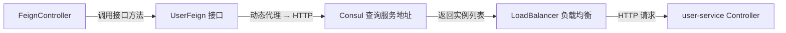

# 依赖引入

**概述：** OpenFeign 通过 `spring-cloud-starter-openfeign` 引入，它内置了 Spring Cloud LoadBalancer 实现客户端负载均衡。==无需额外引入 Ribbon==（已被 LoadBalancer 取代）。

```xml
<dependency>
    <groupId>org.springframework.cloud</groupId>
    <artifactId>spring-cloud-starter-openfeign</artifactId>
</dependency> 
```

# 启用 OpenFeign

**概述：** 在启动类上添加 `@EnableFeignClients` 注解，Spring 会扫描所有 `@FeignClient` 标注的接口并生成动态代理实现。如果 Feign 接口不在启动类所在包的子包下，需通过 `basePackages` 显式指定扫描路径。

```java
@SpringBootApplication
@EnableFeignClients(basePackages = "com.example.feign")
public class FeignApplication {
    public static void main(String[] args) {
        SpringApplication.run(FeignApplication.class, args);
    }
}
```

# Feign 接口定义

**概述：** Feign 接口是远程调用的==契约==。`@FeignClient` 的 `value` 属性指定目标服务在 Consul 中的注册名称，接口方法的签名（URL、参数、返回值）必须与目标服务的 Controller 方法完全一致。

```java
@FeignClient(value = "user-service", fallback = UserFeignFallback.class)
public interface UserFeign {

    @GetMapping("/user/findById")
    Result findById(@RequestParam("id") Long id);

    @PostMapping("/user/save")
    Result save(@RequestBody User user);

    @GetMapping("/user/list")
    Result list(@RequestParam("page") Integer page,
                @RequestParam("size") Integer size);
}
```



**概述：** 参数传递注意事项：

| 场景 | 注解 | 说明 |
|------|------|------|
| 简单参数 | `@RequestParam` | ==必须显式指定 value==，不能省略 |
| 路径参数 | `@PathVariable` | 必须显式指定 value |
| JSON 对象 | `@RequestBody` | 一个方法只能有一个 `@RequestBody` |
| 请求头 | `@RequestHeader` | 传递 Token 等认证信息 |

# Feign Controller

**概述：** Feign 模块的 Controller 作为==对外入口==，注入 Feign 接口，通过调用接口方法实现对远程服务的透明访问。对外暴露的是 Feign 模块的地址，而非目标服务的地址。

```java
@RestController
@RequestMapping("/api/user")
public class UserFeignController {

    @Autowired
    private UserFeign userFeign;

    @GetMapping("/findById")
    public Result findById(@RequestParam Long id) {
        return userFeign.findById(id);
    }

    @PostMapping("/save")
    public Result save(@RequestBody User user) {
        return userFeign.save(user);
    }
}
```

# 负载均衡配置

**概述：** OpenFeign 默认集成 Spring Cloud LoadBalancer，当目标服务有多个实例时自动进行==轮询==负载均衡。可通过自定义配置类切换策略（如随机）。

```java
public class LoadBalancerConfig {
    @Bean
    public ReactorLoadBalancer<ServiceInstance> randomLoadBalancer(
            Environment environment,
            LoadBalancerClientFactory factory) {
        String name = environment.getProperty(
            LoadBalancerClientFactory.PROPERTY_NAME);
        return new RandomLoadBalancer(
            factory.getLazyProvider(name, ServiceInstanceListSupplier.class),
            name);
    }
}
```

**概述：** 在 Feign 接口上通过 `@LoadBalancerClient` 指定自定义配置：

```java
@FeignClient(value = "user-service")
@LoadBalancerClient(value = "user-service",
                    configuration = LoadBalancerConfig.class)
public interface UserFeign {
    // ...
}
```

# 常用配置项

```yaml
feign:
  client:
    config:
      default:
        connect-timeout: 5000
        read-timeout: 10000
        logger-level: FULL
  compression:
    request:
      enabled: true
      mime-types: text/xml,application/xml,application/json
      min-request-size: 2048
    response:
      enabled: true
```

| 配置项 | 说明 | 默认值 |
|-------|------|-------|
| `feign.client.config.default.connect-timeout` | 连接超时（毫秒） | `10000` |
| `feign.client.config.default.read-timeout` | 读取超时（毫秒） | `60000` |
| `feign.client.config.default.logger-level` | 日志级别（NONE/BASIC/HEADERS/FULL） | `NONE` |
| `feign.compression.request.enabled` | 请求 GZIP 压缩 | `false` |
| `feign.compression.response.enabled` | 响应 GZIP 压缩 | `false` |

## Further Reading

- [Spring Cloud OpenFeign 官方文档](https://docs.spring.io/spring-cloud-openfeign/docs/current/reference/html/)
- [Spring Cloud LoadBalancer 文档](https://docs.spring.io/spring-cloud-commons/docs/current/reference/html/#spring-cloud-loadbalancer)
- [OpenFeign GitHub 仓库](https://github.com/OpenFeign/feign)
- [Feign 参数传递最佳实践](https://docs.spring.io/spring-cloud-openfeign/docs/current/reference/html/#spring-cloud-feign-overriding-defaults)
