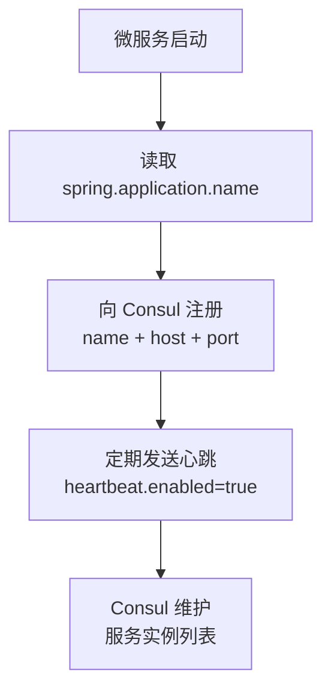
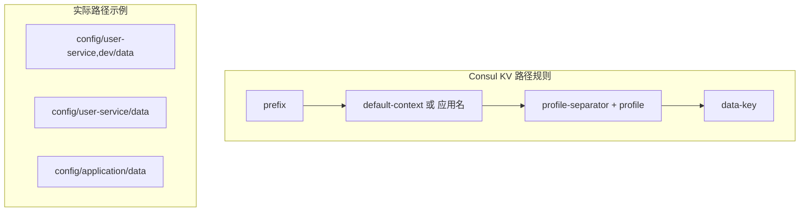

# 依赖引入

**概述：** Spring Cloud Consul 的核心依赖分为两个 starter：`consul-discovery`（服务注册发现）和 `consul-config`（KV 配置中心）。可按需引入，也可同时使用。==Actuator 是健康检查的必要依赖，不可省略==。

## 服务注册发现

```xml
<dependency>
    <groupId>org.springframework.cloud</groupId>
    <artifactId>spring-cloud-starter-consul-discovery</artifactId>
</dependency>

<!-- Actuator（健康检查必需） -->
<dependency>
    <groupId>org.springframework.boot</groupId>
    <artifactId>spring-boot-starter-actuator</artifactId>
</dependency>
```

## KV 配置中心

```xml
<dependency>
    <groupId>org.springframework.cloud</groupId>
    <artifactId>spring-cloud-starter-consul-config</artifactId>
</dependency>

<!-- Bootstrap 上下文支持（Spring Boot 2.4+ 必需） -->
<dependency>
    <groupId>org.springframework.cloud</groupId>
    <artifactId>spring-cloud-starter-bootstrap</artifactId>
</dependency>
```

**概述：** Spring Boot 2.4+ 默认禁用了 bootstrap 上下文加载。使用 Consul 配置中心时，==必须引入 `spring-cloud-starter-bootstrap`== 以恢复 `bootstrap.yml` 的优先加载机制。另一种方式是使用 `spring.config.import`（见后文）。

# 版本对齐

**概述：** Spring Cloud 版本必须与 Spring Boot 版本严格对应，通过父项目的 `<dependencyManagement>` 统一管理。==版本不匹配会导致类找不到或行为异常==。

```xml
<dependencyManagement>
    <dependencies>
        <dependency>
            <groupId>org.springframework.cloud</groupId>
            <artifactId>spring-cloud-dependencies</artifactId>
            <version>2021.0.8</version>
            <type>pom</type>
            <scope>import</scope>
        </dependency>
    </dependencies>
</dependencyManagement>
```

| Spring Cloud 版本 | 对应 Spring Boot | Consul Agent 推荐版本 |
|-------------------|-----------------|---------------------|
| 2021.0.x | 2.6.x / 2.7.x | 1.11+ |
| 2022.0.x | 3.0.x / 3.1.x | 1.13+ |
| 2023.0.x | 3.2.x / 3.3.x | 1.15+ |

# 启动类注解

**概述：** 在启动类上添加 `@EnableDiscoveryClient` 注解激活服务发现功能。Spring Cloud Edgware+ 版本中，只要引入 `consul-discovery` 依赖即可自动激活，`@EnableDiscoveryClient` 可省略但==显式标注更清晰==。

```java
@SpringBootApplication
@EnableDiscoveryClient
public class UserServiceApplication {
    public static void main(String[] args) {
        SpringApplication.run(UserServiceApplication.class, args);
    }
}
```

# 服务注册发现配置

## application.yml

```yaml
server:
  port: 8081

spring:
  application:
    name: user-service
  cloud:
    consul:
      host: localhost
      port: 8500
      discovery:
        service-name: ${spring.application.name}
        instance-id: ${spring.application.name}-${server.port}
        prefer-ip-address: true
        heartbeat:
          enabled: true
        health-check-path: /actuator/health
        health-check-interval: 10s

# Actuator 端点暴露
management:
  endpoints:
    web:
      exposure:
        include: health,info
  endpoint:
    health:
      show-details: always
```



## 配置项详解

| 配置项 | 说明 | 默认值 |
|-------|------|-------|
| `spring.cloud.consul.host` | Consul Agent 地址 | `localhost` |
| `spring.cloud.consul.port` | Consul Agent 端口 | `8500` |
| `discovery.service-name` | 注册的服务名 | `${spring.application.name}` |
| `discovery.instance-id` | 实例唯一标识 | `服务名-端口` |
| `discovery.prefer-ip-address` | 使用 IP 注册而非主机名 | `false` |
| `discovery.heartbeat.enabled` | ==启用心跳==（关键） | `false` |
| `discovery.health-check-path` | 健康检查路径 | `/actuator/health` |
| `discovery.health-check-interval` | 健康检查间隔 | `10s` |
| `discovery.register` | 是否注册到 Consul | `true` |
| `discovery.enabled` | 是否启用服务发现 | `true` |
| `discovery.tags` | 服务标签（元数据） | 空 |

**概述：** ==心跳必须开启==（`heartbeat.enabled: true`）。Spring Cloud Consul 默认使用 TTL 心跳模式：应用主动向 Consul 发送心跳证明存活，而非 Consul 主动探测。如果不开启心跳，Consul 会在健康检查超时后将服务标记为 critical。

**概述：** `prefer-ip-address: true` 在==容器化部署==（Docker/K8s）中尤为重要——默认注册的是容器主机名（如 `a1b2c3d4e5f6`），其他服务无法通过该主机名访问。

# KV 配置中心配置

## bootstrap.yml 方式（传统）

**概述：** Consul 配置中心的连接信息==必须放在 `bootstrap.yml`== 中，因为它需要在 `application.yml` 加载之前连接 Consul 获取配置。

```yaml
spring:
  application:
    name: user-service
  profiles:
    active: dev
  cloud:
    consul:
      host: localhost
      port: 8500
      config:
        enabled: true
        prefix: config
        default-context: application
        profile-separator: ","
        format: YAML
        data-key: data
        watch:
          enabled: true
          delay: 1000
```

## spring.config.import 方式（Spring Boot 2.4+）

**概述：** Spring Boot 2.4+ 推荐使用 `spring.config.import` 替代 bootstrap.yml，无需引入 `spring-cloud-starter-bootstrap`。

```yaml
# application.yml
spring:
  application:
    name: user-service
  config:
    import: consul:localhost:8500
  cloud:
    consul:
      config:
        format: YAML
        data-key: data
        watch:
          enabled: true
```

## 配置项详解

| 配置项 | 说明 | 默认值 |
|-------|------|-------|
| `config.enabled` | 是否启用配置中心 | `true` |
| `config.prefix` | KV 中的根目录 | `config` |
| `config.default-context` | 全局配置目录名 | `application` |
| `config.profile-separator` | Profile 分隔符 | `,` |
| `config.format` | 配置格式（==YAML==/PROPERTIES/KEY_VALUE/FILES） | `KEY_VALUE` |
| `config.data-key` | KV 中存储配置内容的 Key 名 | `data` |
| `config.watch.enabled` | 是否监听配置变更 | `true` |
| `config.watch.delay` | 监听轮询间隔（ms） | `1000` |



## 在 Consul 中创建配置

**概述：** 通过 Consul Web UI 或 HTTP API 在 KV 中写入配置：

```bash
# 通过 CLI 写入 YAML 配置
consul kv put config/user-service/data @config.yaml

# 通过 HTTP API
curl -X PUT -d @config.yaml \
  http://localhost:8500/v1/kv/config/user-service/data
```

**概述：** 在 Web UI 中操作：Key/Value → Create → 输入 Key 路径（如 `config/user-service/data`）→ 在 Value 中填入 YAML 内容 → Save。

# 动态刷新配置

**概述：** 使用 `@RefreshScope` 注解标记需要动态更新的 Bean。Consul Watch 检测到 KV 变更后，自动触发 `RefreshEvent`，带有 `@RefreshScope` 的 Bean 会被销毁重建，注入最新配置值。

```java
@RestController
@RefreshScope
public class ConfigDemoController {

    @Value("${custom.message:默认值}")
    private String message;

    @Value("${custom.max-retry:3}")
    private int maxRetry;

    @GetMapping("/config/message")
    public String getMessage() {
        return message;
    }
}
```

**概述：** 注意事项：

- `@RefreshScope` 的 Bean 在刷新时会被==销毁并重建==，如果持有不可重建的资源（如数据库连接池），不应标注此注解
- `@ConfigurationProperties` 标注的类==无需 `@RefreshScope`==，它们天然支持动态刷新
- 修改 Consul KV 后，默认最多 ==1 秒==后生效（`watch.delay`）

# ACL Token 配置

**概述：** 生产环境启用 ACL 后，微服务需要携带 Token 才能访问 Consul API。==通过环境变量注入 Token，不要硬编码==。

```yaml
spring:
  cloud:
    consul:
      discovery:
        acl-token: ${CONSUL_ACL_TOKEN}
      config:
        acl-token: ${CONSUL_ACL_TOKEN}
```

```bash
# 启动时通过环境变量传入
CONSUL_ACL_TOKEN=xxxx-xxxx-xxxx java -jar app.jar

# Docker 方式
docker run -e CONSUL_ACL_TOKEN=xxxx-xxxx-xxxx app-image
```

# 常见问题排查

**概述：** 集成 Consul 时的高频问题及解决方案：

| 问题 | 原因 | 解决方案 |
|------|------|---------|
| 服务注册后立即变为 critical | 心跳未开启 | `heartbeat.enabled: true` |
| 健康检查路径 404 | Spring Boot 2.x Actuator 路径变更 | `health-check-path: /actuator/health` |
| 多网卡注册了错误 IP | 默认注册主机名或错误网卡 | `prefer-ip-address: true` + `ip-address` 显式指定 |
| 配置中心无法加载 | 配置写在 application.yml 而非 bootstrap.yml | 迁移至 `bootstrap.yml` 或使用 `spring.config.import` |
| 配置修改后不生效 | Bean 未标注 `@RefreshScope` | 添加 `@RefreshScope` 或使用 `@ConfigurationProperties` |
| 版本不兼容 ClassNotFound | Spring Cloud 与 Spring Boot 版本不匹配 | 对齐版本（见版本对齐表） |

## Further Reading

- [Spring Cloud Consul 官方文档](https://docs.spring.io/spring-cloud-consul/reference/html/)
- [Spring Cloud Consul Config 文档](https://docs.spring.io/spring-cloud-consul/reference/config.html)
- [Spring Cloud Consul 中文文档](https://www.springcloud.cc/spring-cloud-consul.html)
- [Consul 入门教程（2024）](https://www.techgrow.cn/posts/ce63e626.html)
- [Spring Cloud 与 Spring Boot 版本对应](https://spring.io/projects/spring-cloud#overview)
- [Consul ACL 文档](https://developer.hashicorp.com/consul/docs/security/acl)
