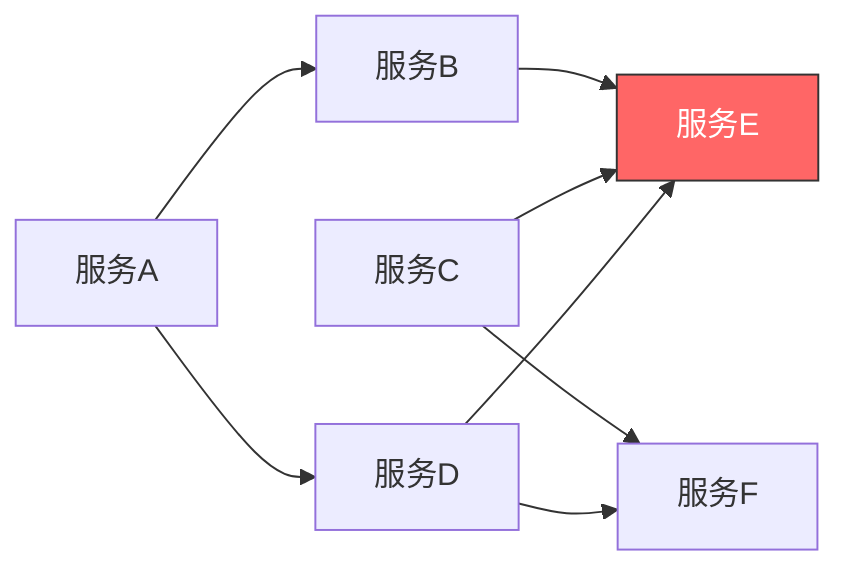
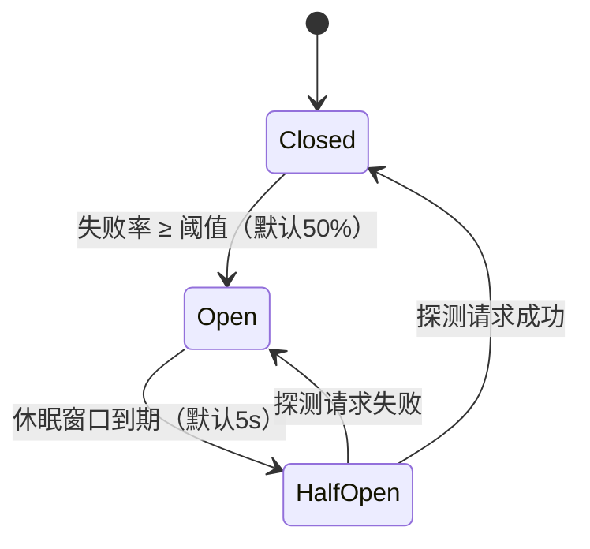
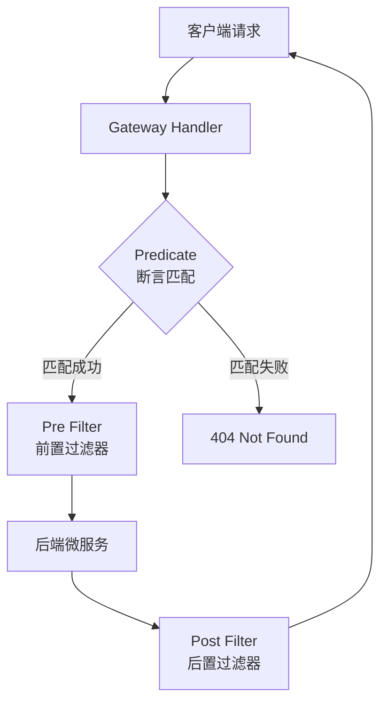

# 微服务雪崩效应

**概述：** 在微服务架构中，服务之间存在复杂的调用链路。当某个服务出现故障或响应延迟时，故障会沿着调用链路向上游蔓延，导致大量请求阻塞、线程资源耗尽，最终引发整个系统瘫痪——这就是==雪崩效应（Cascade Failure）==。



**概述：** 以上图为例，当服务 E 发生故障时，依赖它的 B、D 以及间接依赖的 A、C 都会陷入线程阻塞，最终所有请求链路全部瘫痪。微服务架构引入了==熔断器（Circuit Breaker）==等容错机制来防止雪崩。熔断器一词源于电路中的过载保护装置——当线路故障时自动切断电源保护电路。

# Hystrix 服务降级与熔断

**概述：** Spring Cloud Hystrix 基于 Netflix Hystrix 实现，是微服务容错的核心组件。它提供服务降级（Fallback）、服务熔断（Circuit Breaking）、线程隔离（Thread Isolation）、请求缓存（Request Caching）和请求合并（Request Collapsing）等能力，有效阻止分布式系统中的联动故障。

## 服务降级 vs 服务熔断

**概述：** ==服务降级==是指当目标服务不可用时，客户端执行预设的兜底逻辑（Fallback），返回默认值或友好提示而非直接报错。==服务熔断==是指当失败率达到阈值后，熔断器自动切断对下游服务的调用，在一段时间内直接走降级逻辑，避免无效请求持续消耗资源。

- 降级是**被动响应**：调用失败后执行备选方案
- 熔断是**主动保护**：检测到故障率过高后直接拒绝调用

## 熔断器状态机

**概述：** Hystrix 熔断器有三种状态，按照失败率和时间窗口自动切换。



- **Closed（关闭）**：正常状态，请求正常转发，同时统计失败率
- **Open（打开）**：失败率超过阈值，所有请求直接走降级逻辑，不再调用下游服务
- **Half-Open（半开）**：经过休眠时间窗口后允许一个探测请求通过，若成功则恢复 Closed，若失败则重新进入 Open

## 线程隔离

**概述：** Hystrix 通过==线程池隔离==为每个服务调用分配独立线程池，防止某个慢服务占满全局线程。另一种模式是==信号量隔离==，通过限制并发量控制访问，适用于本地高速调用场景。

| 隔离方式 | 特点 | 适用场景 |
|---------|------|---------|
| 线程池隔离 | 独立线程池，支持超时中断，有线程切换开销 | 远程服务调用（HTTP / RPC） |
| 信号量隔离 | 无线程切换开销，轻量级，不支持超时中断 | 本地方法调用、缓存访问 |

## Feign 整合 Hystrix

**概述：** 在 Spring Cloud 中，Hystrix 通常与 OpenFeign 配合使用。通过在 `@FeignClient` 注解中指定 `fallback` 属性，当目标服务不可用时自动执行降级类中的实现方法。降级类实现 Feign 接口并重写所有方法返回兜底响应，将降级逻辑与业务代码彻底解耦。

```java
// Feign 接口指定 fallback 降级类
@FeignClient(name = "demo-web", fallback = StudentHystrix.class)
public interface StudentFeign {
    @RequestMapping("/student/test")
    Result test();
}

// 降级类实现 Feign 接口
@Component
public class StudentHystrix implements StudentFeign {
    @Override
    public Result test() {
        return Result.fail("服务不可用，请稍后重试");
    }
}
```

**概述：** 生产环境推荐使用 `FallbackFactory` 替代直接 `fallback`，它能捕获触发降级的异常信息，便于日志记录和问题排查。

## Hystrix 替代方案

**概述：** Netflix Hystrix 已于 2018 年进入维护模式，不再开发新功能。Spring Cloud 2020+ 版本推荐使用 ==Resilience4j== 作为替代。Resilience4j 是一个轻量级容错库，提供 CircuitBreaker、RateLimiter、Retry、Bulkhead 等模块，基于函数式编程设计，与 Spring Boot / Spring Cloud Gateway 深度集成。

| 对比项 | Hystrix | Resilience4j |
|-------|---------|-------------|
| 维护状态 | 停更（维护模式） | 活跃开发 |
| 隔离策略 | 线程池 / 信号量 | 信号量 / 线程池 |
| 编程模型 | 注解 + HystrixCommand | 函数式 + 注解 |
| 依赖量 | 较重（Archaius、RxJava） | 轻量（仅 Vavr） |
| 监控 | Hystrix Dashboard | Micrometer + Prometheus |

# Spring Cloud Gateway 网关

**概述：** Spring Cloud Gateway 是 Spring Cloud 官方推荐的第二代 API 网关，替代已停更的 Zuul 1.x。它基于 ==Spring WebFlux==（响应式编程模型）和 ==Project Reactor== 构建，具备高性能非阻塞特性，提供统一入口、动态路由、负载均衡和过滤器等核心能力。

## 网关的作用

- **统一访问入口**：所有外部请求通过网关转发，简化客户端与微服务的直接通信
- **动态路由**：根据路径、参数、Header 等条件将请求路由到不同的后端服务
- **负载均衡**：集成 Spring Cloud LoadBalancer，从注册中心获取实例列表并按策略分发
- **过滤器机制**：在请求转发前后执行鉴权、限流、日志、跨域等处理逻辑

## 核心概念

**概述：** Gateway 的工作机制围绕三个核心组件展开：Route（路由）、Predicate（断言）、Filter（过滤器）。



- **Route（路由）**：最基本的转发单元，由 ID、目标 URI、一组 Predicate 和一组 Filter 组成
- **Predicate（断言）**：匹配请求的条件，满足全部条件的请求才会被路由到目标服务
- **Filter（过滤器）**：在请求转发前后执行处理逻辑，分为 GatewayFilter（针对单个路由）和 GlobalFilter（全局生效）

## 内置断言类型

| 断言工厂 | 说明 | 配置示例 |
|---------|------|---------|
| Path | 匹配请求路径 | `Path=/api/**` |
| Method | 匹配 HTTP 方法 | `Method=GET,POST` |
| Query | 匹配请求参数（参数必须存在） | `Query=name` |
| Header | 匹配请求头 | `Header=X-Token, \d+` |
| Cookie | 匹配 Cookie 值 | `Cookie=session, abc.*` |
| After / Before / Between | 匹配时间范围 | `After=2024-01-01T00:00:00+08:00` |
| RemoteAddr | 匹配客户端 IP 段 | `RemoteAddr=192.168.1.0/24` |

**概述：** 同一路由下配置多个断言时，它们之间是 ==AND== 关系——所有断言都匹配时请求才会被路由。

## 内置过滤器

**概述：** Gateway 提供了丰富的内置过滤器（GatewayFilter），以下是常用类型：

- **StripPrefix**：去除路径前缀。`StripPrefix=1` 将 `/api/user/list` 转为 `/user/list`
- **AddRequestHeader / AddResponseHeader**：添加请求头或响应头
- **RewritePath**：路径重写，支持正则表达式
- **RequestRateLimiter**：基于 Redis 的令牌桶限流
- **CircuitBreaker**：集成熔断器（Resilience4j）

## 负载均衡

**概述：** Gateway 配合服务注册中心（Consul / Eureka / Nacos）实现客户端负载均衡。路由 URI 使用 `lb://服务名` 格式，Gateway 自动从注册中心获取该服务的全部实例并按策略分发请求。==多个服务实例只需保持 `spring.application.name` 一致==，Gateway 默认使用轮询策略均匀分配。

## Gateway vs Zuul

| 对比项 | Spring Cloud Gateway | Zuul 1.x |
|-------|---------------------|-----------|
| 编程模型 | 响应式（WebFlux + Reactor） | Servlet 阻塞式 |
| 性能 | 高（非阻塞 I/O） | 较低（每请求一个线程） |
| 长连接支持 | 支持 WebSocket | 不支持 |
| 维护状态 | Spring 官方活跃维护 | Netflix 停更 |
| 过滤器类型 | Pre / Post / Global | Pre / Route / Post / Error |
| 限流 | 内置 RequestRateLimiter | 需自行实现 |

# Spring Boot 多环境配置

**概述：** Spring Boot 通过 ==Profile 机制==支持多环境配置管理。不同环境（开发、测试、生产）使用不同的配置文件，通过激活指定 Profile 来加载对应配置，避免手动修改配置项导致的部署错误。

## Profile 命名规则

**概述：** 配置文件遵循 `application-{profile}.yml` 或 `application-{profile}.properties` 的命名约定。`application.yml` 是通用配置，所有环境共享；Profile 配置文件中的同名属性会==覆盖==通用配置中的对应值。

```
resources/
├── application.yml            # 通用配置（所有环境共享）
├── application-dev.yml        # 开发环境
├── application-test.yml       # 测试环境
└── application-prod.yml       # 生产环境
```

## 激活方式

**概述：** 有多种方式激活指定 Profile，优先级从高到低依次为：

1. **命令行参数**：`java -jar app.jar --spring.profiles.active=prod`
2. **环境变量**：`SPRING_PROFILES_ACTIVE=prod`
3. **配置文件**：在 `application.yml` 中设置 `spring.profiles.active: dev`
4. **Maven Profile 联动**：通过 `@activatedProperties@` 占位符与 Maven 构建 Profile 绑定

**概述：** 多环境配置的核心原则是==通用配置放 application.yml，差异化配置放对应的 Profile 文件==。数据库连接、服务端口、日志级别、第三方 API 地址等通常随环境变化，适合放入 Profile 配置。

## 使用示例

**概述：** 创建 `application-dev.yml` 配置开发环境端口和数据源，在主配置文件中激活。

```yaml
# application-dev.yml
server:
  port: 8080

spring:
  datasource:
    url: jdbc:mysql://localhost:3306/dev_db
    username: root
    password: root123
```

```properties
# application.properties
spring.profiles.active=dev
```

## Further Reading

- [Spring Cloud Hystrix Wiki（已归档）](https://github.com/Netflix/Hystrix/wiki)
- [Resilience4j 官方文档](https://resilience4j.readme.io/docs/getting-started)
- [Spring Cloud Gateway 官方文档](https://docs.spring.io/spring-cloud-gateway/reference/)
- [Spring Boot Profiles 官方文档](https://docs.spring.io/spring-boot/docs/current/reference/html/features.html#features.profiles)
